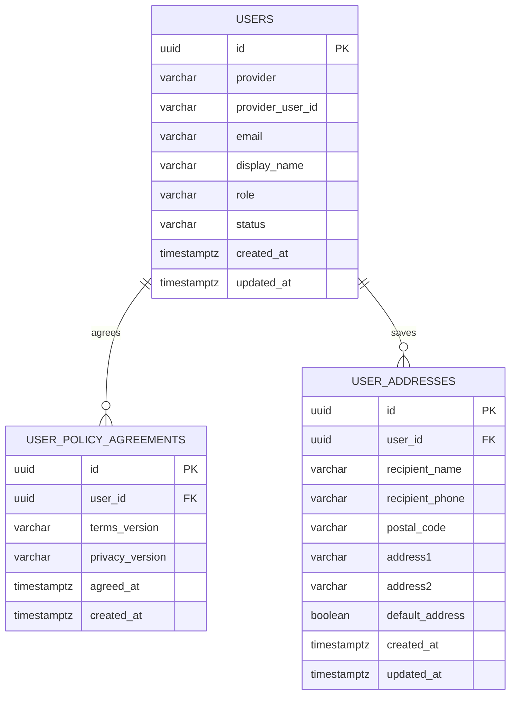

# MVP ERD

이 문서는 MVP 구현 전반의 데이터 모델 기준을 정리한다.

`docs/domain-model.md`는 도메인별 필드 후보와 모델링 이유를 설명하는 기준 문서이고, 이 문서는 구현자가 관계를 빠르게 확인하기 위한 ERD 기준 문서다.

## Status

- `users` table: implemented in `apps/api/src/main/resources/db/migration/V1__create_users.sql`.
- Catalog tables: implemented in `apps/api/src/main/resources/db/migration/V2__create_catalog.sql`.
- Cart tables: implemented in `apps/api/src/main/resources/db/migration/V3__create_cart.sql`.
- Checkout/order tables: implemented in `apps/api/src/main/resources/db/migration/V4__create_checkout_order.sql`.
- Payment attempt tables: implemented in `apps/api/src/main/resources/db/migration/V5__create_payment.sql`.
- DS-11 admin order queue is implemented with existing order, order item, payment, supplier, and user tables; no schema change was required.
- Fulfillment and admin order action history tables: implemented in `apps/api/src/main/resources/db/migration/V6__create_fulfillment.sql`.
- Shipment table: implemented in `apps/api/src/main/resources/db/migration/V7__create_shipment.sql`.
- Claim table: implemented in `apps/api/src/main/resources/db/migration/V8__create_claim.sql`.
- Refund table: implemented in `apps/api/src/main/resources/db/migration/V9__create_refund.sql`.
- User policy agreement table: implemented in `apps/api/src/main/resources/db/migration/V10__create_user_policy_agreements.sql`.
- User address table: implemented in `apps/api/src/main/resources/db/migration/V11__create_user_addresses.sql`.
- Policy and remaining audit tables: planned.

## Modeling Rules

- MVP uses PostgreSQL.
- Primary keys use `UUID`.
- Customer-facing supplier information should be shown as delivery group, not raw supplier identity.
- Product and product option do not store real stock quantity in MVP. Sellability is controlled by status.
- Paid orders keep product name, option name, price, product summary, product detail reference, and product notice reference as snapshots.
- One checkout creates one `payment_group`.
- One `payment_group` may contain multiple delivery-group orders.
- One MVP order belongs to one delivery group.
- Refund can be scoped to a full payment group or one delivery-group order.
- Claim status and refund status are separate.
- Transactional notification history is separate from marketing consent.

## Current Implemented Schema

Current implementation intentionally stores social identity directly on `users`.

Conceptually, `User` and `SocialAccount` are separate in `docs/domain-model.md`, but MVP social-login-only policy and no account-merge scope allow the first implementation to keep provider identity on `users`. If account merge or multiple linked providers becomes necessary later, split `users` and `social_accounts` with a migration.

Additional implemented table groups:

- Account: `users`, `user_policy_agreements`, `user_addresses`
- Catalog: `suppliers`, `products`, `product_options`, `product_images`, `product_detail_blocks`, `product_notices`, `product_change_histories`
- Cart: `carts`, `cart_items`
- Checkout/order: `payment_groups`, `orders`, `order_items`, `order_policy_agreements`
- Payment: `payments`, `payment_events`

Deletion/rejoin note:

- Current `users(provider, provider_user_id)` uniqueness blocks rejoining with the same social account unless deletion anonymizes or tombstones provider identity.
- Before account deletion is implemented, add a migration strategy: either split `social_accounts` with active-only uniqueness, or update deleted rows so provider identity no longer conflicts with a new account.
- Add `deleted_at` and `anonymized_at` or equivalent fields before implementing account deletion.

## MVP Planned ERD

```mermaid
erDiagram
    USERS ||--o{ USER_ADDRESSES : saves
    USERS ||--o{ CARTS : owns
    USERS ||--o{ ORDERS : places
    USERS ||--o{ PAYMENT_GROUPS : pays
    USERS ||--o{ CLAIMS : requests
    USERS ||--o{ USER_POLICY_AGREEMENTS : agrees
    USERS ||--o{ MARKETING_CONSENTS : controls

    SUPPLIERS ||--o{ PRODUCTS : supplies
    SUPPLIERS ||--o{ DELIVERY_GROUPS : maps_to
    SUPPLIERS ||--o{ FULFILLMENTS : receives_orders

    PRODUCTS ||--o{ PRODUCT_OPTIONS : has
    PRODUCTS ||--o{ PRODUCT_IMAGES : has
    PRODUCTS ||--o{ PRODUCT_DETAIL_BLOCKS : has
    PRODUCTS ||--o{ PRODUCT_NOTICES : has
    PRODUCTS ||--o{ PRODUCT_CHANGE_HISTORIES : changes
    PRODUCT_OPTIONS ||--o{ PRODUCT_CHANGE_HISTORIES : changes

    CARTS ||--o{ CART_ITEMS : contains
    PRODUCTS ||--o{ CART_ITEMS : selected_product
    PRODUCT_OPTIONS ||--o{ CART_ITEMS : selected_option

    PAYMENT_GROUPS ||--o{ ORDERS : contains
    DELIVERY_GROUPS ||--o{ ORDERS : groups
    ORDERS ||--o{ ORDER_ITEMS : contains
    PRODUCTS ||--o{ ORDER_ITEMS : snapshotted_product
    PRODUCT_OPTIONS ||--o{ ORDER_ITEMS : snapshotted_option

    PAYMENT_GROUPS ||--o{ PAYMENTS : attempts
    PAYMENT_GROUPS ||--o{ PAYMENT_EVENTS : records
    PAYMENTS ||--o{ PAYMENT_EVENTS : emits

    ORDERS ||--|| FULFILLMENTS : fulfills
    ORDERS ||--o| SHIPMENTS : ships
    ORDERS ||--o{ REFUNDS : refunds
    PAYMENT_GROUPS ||--o{ REFUNDS : refunds
    PAYMENTS ||--o{ REFUNDS : executes
    ORDERS ||--o{ CLAIMS : has
    CLAIMS ||--o| REFUNDS : may_create

    ORDERS ||--o{ ORDER_STATUS_HISTORIES : records
    USERS ||--o{ ORDER_STATUS_HISTORIES : acts
    USERS ||--o{ ADMIN_ACTION_HISTORIES : performs

    USERS ||--o{ NOTIFICATION_LOGS : receives
    ORDERS ||--o{ NOTIFICATION_LOGS : triggers
    PAYMENT_GROUPS ||--o{ NOTIFICATION_LOGS : triggers
    CLAIMS ||--o{ NOTIFICATION_LOGS : triggers
    REFUNDS ||--o{ NOTIFICATION_LOGS : triggers

    POLICY_DOCUMENTS ||--o{ USER_POLICY_AGREEMENTS : accepted_as
    PAYMENT_GROUPS ||--o| ORDER_POLICY_AGREEMENTS : confirmed_by
    POLICY_DOCUMENTS ||--o{ PRIVACY_PROCESSING_ITEMS : includes
    USERS ||--o{ LEGAL_RETENTION_RECORDS : former_owner
```

## Account And Auth

### users

Implemented.

Purpose:

- Customer and admin account.
- Social identity anchor for Kakao, Google, and Naver.
- Admin permission source through `role`.

Current fields:

- `id`
- `provider`: `KAKAO` / `GOOGLE` / `NAVER`
- `provider_user_id`
- `email`
- `display_name`
- `role`: `CUSTOMER` / `ADMIN`
- `status`: `ACTIVE` / `DELETED`
- `created_at`
- `updated_at`

Open note:

- `docs/domain-model.md` mentions `SUSPENDED`, but current code has only `ACTIVE` and `DELETED`. Treat suspension as post-MVP until a decision adds it.

### user_policy_agreements

Implemented by DS-31.

Purpose:

- Records required terms and privacy agreement after first login or before checkout.
- Keeps agreement history by policy version pair.

Current fields:

- `id`
- `user_id`
- `terms_version`
- `privacy_version`
- `agreed_at`
- `created_at`

Constraints:

- Unique `(user_id, terms_version, privacy_version)` makes reposting the same required agreement idempotent.
- Checkout creation requires an agreement for the current required terms and privacy versions.

### user_addresses

Implemented by DS-32.

Purpose:

- Customer saved shipping address book.
- Order creation still stores shipping address snapshots on orders.

Key fields:

- `id`
- `user_id`
- `recipient_name`
- `recipient_phone`
- `postal_code`
- `address1`
- `address2`
- `default_address`
- `created_at`
- `updated_at`

Rules:

- Rows are scoped by `user_id`.
- First saved address becomes default automatically.
- Service logic keeps one default address when addresses remain.

### social_accounts

Deferred.

For MVP, social identity is collapsed into `users`. Split this table later only if account linking, account merge, or multiple providers per user are introduced.

## Catalog

Implemented by DS-6.

### suppliers

- `id`
- `name`
- `contact_name`
- `phone`
- `email`
- `memo`
- `status`: `ACTIVE` / `INACTIVE`
- `created_at`
- `updated_at`

Relationships:

- One supplier has many products.
- MVP uses one active delivery group per supplier with `shipping_fee = 0`.
- Multiple delivery groups per supplier are future scope unless a later decision adds independent delivery configuration.

### products

- `id`
- `supplier_id`
- `name`
- `summary`
- `base_price`
- `status`: `ACTIVE` / `SOLD_OUT` / `HIDDEN` / `STOPPED`
- `thumbnail_image_url`: optional denormalized cache
- `created_at`
- `updated_at`

Rules:

- No real stock quantity.
- Customer-visible sale requires product `ACTIVE` and option `ACTIVE`.
- Canonical thumbnail data lives in `product_images` where `type = THUMBNAIL`.
- If `thumbnail_image_url` is kept on `products`, it is a cache updated from canonical thumbnail image metadata.

### product_options

- `id`
- `product_id`
- `name`
- `additional_price`
- `status`: `ACTIVE` / `SOLD_OUT` / `STOPPED`
- `created_at`
- `updated_at`

### product_images

- `id`
- `product_id`
- `type`: `THUMBNAIL` / `GALLERY`
- `image_url`
- `sort_order`
- `alt_text`
- `created_at`
- `updated_at`

Constraints:

- One thumbnail image per product.
- Up to ten gallery images per product.

### product_detail_blocks

- `id`
- `product_id`
- `type`: `IMAGE` / `HTML`
- `image_url`
- `html_content`
- `sort_order`
- `alt_text`
- `created_at`
- `updated_at`

Rules:

- HTML must be sanitized.
- Shipping, exchange, refund, and out-of-stock notices must not live only inside detail blocks.

### product_notices

Implemented by DS-6.

Purpose:

- Versioned product information notice and product-specific shipping, AS, return, and exchange information.
- Source for `OrderItem.productNoticeSnapshotId` or an equivalent immutable order snapshot reference.

Key fields:

- `id`
- `product_id`
- `version`
- `status`: `DRAFT` / `ACTIVE` / `ARCHIVED`
- `product_info_notice`
- `shipping_info`
- `as_info`
- `return_exchange_info`
- `effective_from`
- `created_at`
- `updated_at`

Rule:

- Paid orders should reference the active notice version used at checkout time.

## Cart

Implemented by DS-7.

### carts

- `id`
- `user_id`
- `created_at`
- `updated_at`

Constraints:

- `user_id` is unique. One customer has one current cart.
- `user_id` references `users(id)`.

### cart_items

- `id`
- `cart_id`
- `product_id`
- `product_option_id`
- `quantity`
- `created_at`
- `updated_at`

Constraints:

- `(cart_id, product_option_id)` is unique. Adding the same option increases quantity instead of creating a second row.
- `quantity` is constrained to 1 through 99.
- `cart_id` references `carts(id)` with cascade delete.
- `product_id` references `products(id)`.
- `product_option_id` references `product_options(id)`.

Rules:

- Guest carts are excluded from MVP.
- A product option can be added only while product status is `ACTIVE` and option status is `ACTIVE`.
- If product or option status changes after being added, the cart item remains but is marked unavailable.
- Cart items must revalidate product and option sellability before order creation.
- Cart item prices are displayed from current product and option prices. Final order price is snapshotted during order creation.

## Order And Checkout

Implemented by DS-8 except `delivery_groups`, which is deferred and derived from supplier for MVP.

### delivery_groups

- `id`
- `supplier_id`
- `display_name`
- `shipping_fee`
- `created_at`
- `updated_at`

Open note:

- Delivery group is supplier-backed but customer-facing. If it has no independent configuration, it may be derived from supplier during early implementation. Keep customer responses using delivery group terminology.

### orders

- `id`
- `order_number`
- `user_id`
- `supplier_id`
- `payment_group_id`
- `status`
- `recipient_name`
- `recipient_phone`
- `postal_code`
- `address1`
- `address2`
- `subtotal_amount`
- `shipping_fee`
- `discount_amount`
- `total_amount`
- `expires_at`
- `supplier_order_started_at`
- `address_locked_at`
- `address_locked_by_admin_id`
- `created_at`
- `updated_at`

Status set:

- `PAYMENT_PENDING`
- `EXPIRED`
- `PAYMENT_EXCEPTION`
- `SUPPLIER_ORDER_PENDING`
- `SUPPLIER_ORDERED`
- `OUT_OF_STOCK`
- `SHIPPED`
- `DELIVERED`
- `CANCELLED`
- `REFUND_REQUESTED`
- `REFUNDED`

### order_items

- `id`
- `order_id`
- `product_id`
- `product_option_id`
- `supplier_id`
- `product_name`
- `product_summary`
- `product_detail_version`
- `product_notice_version`
- `option_name`
- `unit_price`
- `quantity`
- `line_amount`
- `created_at`
- `updated_at`

Rule:

- Product price and display text must not change for paid orders after product edits.

### order_policy_agreements

- `id`
- `payment_group_id`
- `user_id`
- `terms_version`
- `privacy_version`
- `order_policy_version`
- `cancellation_refund_policy_version`
- `out_of_stock_notice_version`
- `confirmed_notice_text`
- `confirmed_at`
- `created_at`

Open note:

- `docs/domain-model.md` uses `appliedOrderIds`. A join table is cleaner if strict relational modeling is needed. For MVP, payment-group ownership may be enough because a payment group contains the applied orders.

## Payment

### payment_groups

Implemented by DS-8 as the checkout payment aggregate. DS-9 adds PG approval transitions.

- `id`
- `checkout_number`
- `user_id`
- `status`
- `total_amount`
- `approved_amount`
- `refundable_amount`
- `expires_at`
- `approved_at`
- `policy_confirmed_at`
- `created_at`
- `updated_at`

### payments

Implemented by DS-9.

- `id`
- `payment_group_id`
- `provider`: `TOSS_PAYMENTS`
- `provider_payment_key`
- `method`: `CARD` / `EASY_PAY` / `TRANSFER`
- `status`
- `requested_amount`
- `approved_amount`
- `approved_at`
- `exception_reason`
- `idempotency_key`
- `failure_code`
- `failure_message`
- `provider_cancel_transaction_key`
- `cancel_requested_at`
- `cancelled_at`
- `raw_provider_status`
- `last_synced_at`
- `created_at`
- `updated_at`

Relationship note:

- One `payment_group` is intended to represent one PG payment. Keep `payments` as `1:N` to preserve retry/exception history without changing the aggregate.

### payment_events

Implemented by DS-9 for payment confirmation events.

- `id`
- `payment_id`
- `payment_group_id`
- `order_id`
- `provider_payment_key`
- `event_type`
- `idempotency_key`
- `raw_payload`
- `result_message`
- `received_at`
- `processed_at`
- `created_at`

## Fulfillment, Shipment, Refund, Claim

### fulfillments

- `id`
- `order_id`
- `supplier_id`
- `status`: `PENDING` / `ORDERED` / `OUT_OF_STOCK` / `CANCELLED`
- `supplier_order_started_at`
- `supplier_order_number`
- `ordered_address_snapshot`
- `ordered_by_admin_id`
- `ordered_at`
- `expected_ship_date`
- `supplier_response_memo`
- `out_of_stock_reason`
- `created_at`
- `updated_at`

Constraints and indexes:

- Unique `order_id`
- Indexes on `order_id`, `supplier_id`, and `status`

### admin_order_action_histories

- `id`
- `order_id`
- `admin_user_id`
- `action_type`: `SUPPLIER_WORK_START` / `SUPPLIER_ORDER_COMPLETED` / `OUT_OF_STOCK` / `SHIPMENT_STARTED` / `SHIPMENT_MANUAL_CORRECTION`
- `before_status`
- `after_status`
- `reason`
- `created_at`

### order_status_histories

- `id`
- `order_id`
- `actor_user_id`
- `action_type`
- `from_status`
- `to_status`
- `guard_result`
- `side_effect_summary`
- `reason`
- `created_at`

### shipments

- `id`
- `order_id`
- `carrier`
- `tracking_number`
- `status`: `READY` / `SHIPPED` / `DELIVERED`
- `shipped_at`
- `delivered_at`
- `tracking_synced_at`
- `tracking_sync_failure_reason`
- `manual_override`
- `manual_correction_reason`
- `manual_corrected_by_admin_id`
- `manual_corrected_at`
- `created_at`
- `updated_at`

MVP rule:

- One order has at most one shipment.

Constraints and indexes:

- Unique `order_id`
- Indexes on `order_id`, `status`, and `(carrier, tracking_number)`

### refunds

- `id`
- `payment_group_id`
- `order_id`
- `payment_id`
- `reason`
- `status`
- `refund_amount`
- `refund_scope`: `PAYMENT_GROUP` / `DELIVERY_GROUP_ORDER`
- `provider_payment_key`
- `provider_cancel_transaction_key`
- `idempotency_key`
- `failure_code`
- `failure_message`
- `raw_provider_status`
- `requested_at`
- `completed_at`
- `failed_at`
- `created_at`
- `updated_at`

Implemented DS-15 scope:

- One refund per delivery-group order in MVP.
- Refunds are created for approved cancellation and supplier out-of-stock.
- PG cancel result fields and retry failure fields are stored on the refund.

### claims

- `id`
- `order_id`
- `user_id`
- `claim_type`: `CANCEL` / `RETURN` / `EXCHANGE`
- `claim_reason`: `SIMPLE_CHANGE_OF_MIND` / `DEFECT` / `WRONG_DELIVERY` / `DIFFERENT_FROM_PRODUCT_INFO` / `DELIVERY_ISSUE`
- `status`: `REQUESTED` / `UNDER_REVIEW` / `EVIDENCE_REQUESTED` / `APPROVED` / `REJECTED` / `RETURN_WAITING` / `RETURN_RECEIVED` / `REFUND_PROCESSING` / `EXCHANGE_SHIPPING` / `COMPLETED` / `WITHDRAWN`
- `requested_action`: `REFUND` / `EXCHANGE`
- `customer_memo`
- `reviewed_by_admin_id`
- `admin_review_reason`
- `reviewed_at`
- `created_at`
- `updated_at`

Implemented DS-14 scope:

- Self-service eligible cancellation creates an approved `CANCEL` claim and moves the order to `REFUND_REQUESTED`.
- Post-supplier-work cancellation creates a requested `CANCEL` claim for admin review.
- Post-delivery return/exchange claims create requested `RETURN` or `EXCHANGE` claims. Implemented by DS-37.
- Return approval moves the claim to `RETURN_WAITING`; exchange approval keeps `APPROVED` until exchange shipment handling.

Rule:

- Claim approval does not mean refund completion. Refund completion requires PG cancel/refund success.

## Policy, Legal, Audit, Notification

Policy/legal tables:

- `policy_documents`
- `user_policy_agreements`
- `business_profiles`
- `privacy_processing_items`
- `marketing_consents`
- `legal_retention_records`

Audit/notification tables:

- `order_status_histories`
- `admin_action_histories`
- `product_change_histories`
- `notification_logs`

Rules:

- Transactional notifications are not marketing notifications.
- Admin order actions must be action-based, not arbitrary status mutation.
- Product change history starts with price, product status, option status, and supplier changes.

## Implemented Catalog Table Notes

DS-6 implemented:

- `suppliers`
- `products`
- `product_options`
- `product_images`
- `product_detail_blocks`
- `product_change_histories`
- `product_notices`

Implemented catalog must not add:

- Real stock quantity fields.
- Customer-facing supplier exposure.
- Product or option status values outside the policy-approved sets.

## Open Modeling Notes

- `User` and `SocialAccount` are conceptually separate, but currently collapsed into `users`.
- `user_addresses` is required by requirements but not yet present in `docs/domain-model.md`.
- Delivery group can be derived from supplier at first; one active delivery group per supplier is the MVP baseline.
- Image binary storage is outside PostgreSQL; database tables store URLs or object storage keys.
