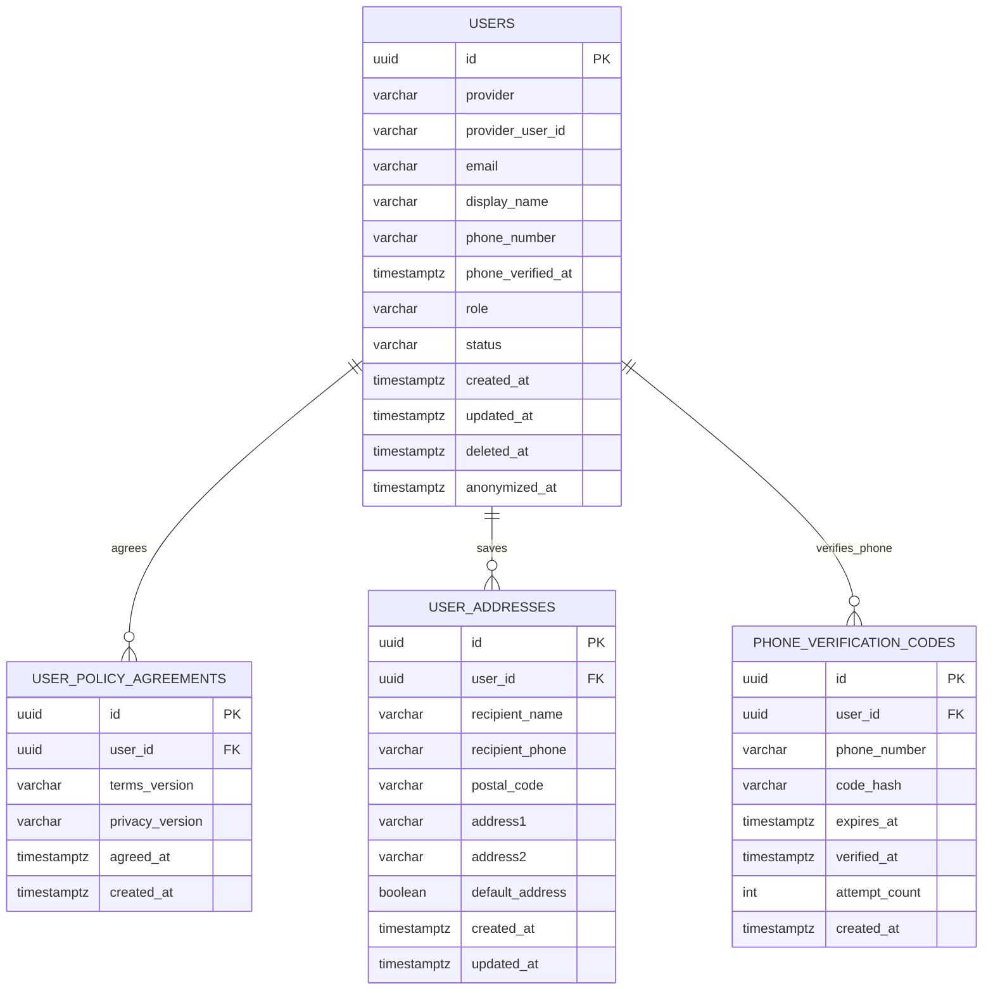

# MVP ERD

이 문서는 MVP 구현 전반의 데이터 모델 기준을 정리한다.

`docs/domain-model.md`는 도메인별 필드 후보와 모델링 이유를 설명하는 기준 문서이고, 이 문서는 구현자가 관계를 빠르게 확인하기 위한 ERD 기준 문서다.

## Status

- `users` table: implemented in `apps/api/src/main/resources/db/migration/V1__create_users.sql`.
- Catalog tables: implemented in `apps/api/src/main/resources/db/migration/V2__create_catalog.sql`.
- Cart tables: implemented in `apps/api/src/main/resources/db/migration/V3__create_cart.sql`.
- Checkout/order tables: implemented in `apps/api/src/main/resources/db/migration/V4__create_checkout_order.sql`.
- Payment attempt tables: implemented in `apps/api/src/main/resources/db/migration/V5__create_payment.sql`.
- DS-11 admin order queue is implemented with existing order, order item, payment, supplier, and user tables; no schema change was required.
- Fulfillment and admin order action history tables: implemented in `apps/api/src/main/resources/db/migration/V6__create_fulfillment.sql`.
- Shipment table: implemented in `apps/api/src/main/resources/db/migration/V7__create_shipment.sql`.
- Claim table: implemented in `apps/api/src/main/resources/db/migration/V8__create_claim.sql`.
- Refund table: implemented in `apps/api/src/main/resources/db/migration/V9__create_refund.sql`.
- User policy agreement table: implemented in `apps/api/src/main/resources/db/migration/V10__create_user_policy_agreements.sql`.
- User address table: implemented in `apps/api/src/main/resources/db/migration/V11__create_user_addresses.sql`.
- Policy document table: implemented in `apps/api/src/main/resources/db/migration/V17__create_policy_documents.sql`.
- Business profile and privacy processing item tables: implemented in `apps/api/src/main/resources/db/migration/V18__create_legal_disclosures.sql`.
- Customer required info and phone verification fields: implemented in `apps/api/src/main/resources/db/migration/V19__add_customer_required_info.sql`.
- Bank-transfer checkout/deposit and manual refund fields: implemented in `apps/api/src/main/resources/db/migration/V23__add_bank_transfer_payment_fields.sql`.
- User deletion timestamp fields: implemented in `apps/api/src/main/resources/db/migration/V26__add_user_deletion_fields.sql`.
- User referral fields: implemented in `apps/api/src/main/resources/db/migration/V28__add_user_referral_fields.sql`.
- Remaining legal/audit tables: planned.

## Modeling Rules

- MVP uses PostgreSQL.
- Primary keys use `UUID`.
- Customer-facing supplier information should be shown as delivery group, not raw supplier identity.
- Product and product option do not store real stock quantity in MVP. Sellability is controlled by status.
- Paid orders keep product name, option name, price, product summary, product detail reference, and product notice reference as snapshots.
- One checkout creates one `payment_group`.
- One `payment_group` may contain multiple delivery-group orders.
- One MVP order belongs to one delivery group.
- Refund can be scoped to a full payment group or one delivery-group order.
- Claim status and refund status are separate.
- Transactional notification history is separate from marketing consent.

## Current Implemented Schema

Current implementation intentionally stores social identity directly on `users`.

Conceptually, `User` and `SocialAccount` are separate in `docs/domain-model.md`, but MVP social-login-only policy and no account-merge scope allow the first implementation to keep provider identity on `users`. If account merge or multiple linked providers becomes necessary later, split `users` and `social_accounts` with a migration.

Additional implemented table groups:

- Account: `users`, `user_policy_agreements`, `user_addresses`
- Catalog: `suppliers`, `products`, `product_options`, `product_images`, `product_detail_blocks`, `product_notices`, `product_change_histories`
- Cart: `carts`, `cart_items`
- Checkout/order: `payment_groups`, `orders`, `order_items`, `order_policy_agreements`
- Payment: `payments`, `payment_events`

Deletion/rejoin note:

- B-014 implements account deletion by setting `users.status=DELETED`, recording `deleted_at` and `anonymized_at`, and anonymizing `provider_user_id` to `deleted-{userId}`.
- Same-provider rejoin creates a new active `users` row because OAuth lookup only reuses `ACTIVE` social identity rows.
- Legal-retention commerce records remain linked to the anonymized user row in MVP. A separate `LegalRetentionRecord` index remains planned for future retention-period automation.

## MVP Planned ERD

```mermaid
erDiagram
    USERS ||--o{ USER_ADDRESSES : saves
    USERS ||--o{ CARTS : owns
    USERS ||--o{ ORDERS : places
    USERS ||--o{ PAYMENT_GROUPS : pays
    USERS ||--o{ CLAIMS : requests
    USERS ||--o{ USER_POLICY_AGREEMENTS : agrees
    USERS ||--o{ MARKETING_CONSENTS : controls

    SUPPLIERS ||--o{ PRODUCTS : supplies
    SUPPLIERS ||--o{ DELIVERY_GROUPS : maps_to
    SUPPLIERS ||--o{ FULFILLMENTS : receives_orders

    PRODUCTS ||--o{ PRODUCT_OPTIONS : has
    PRODUCTS ||--o{ PRODUCT_IMAGES : has
    PRODUCTS ||--o{ PRODUCT_DETAIL_BLOCKS : has
    PRODUCTS ||--o{ PRODUCT_NOTICES : has
    PRODUCTS ||--o{ PRODUCT_CHANGE_HISTORIES : changes
    PRODUCT_OPTIONS ||--o{ PRODUCT_CHANGE_HISTORIES : changes

    CARTS ||--o{ CART_ITEMS : contains
    PRODUCTS ||--o{ CART_ITEMS : selected_product
    PRODUCT_OPTIONS ||--o{ CART_ITEMS : selected_option

    PAYMENT_GROUPS ||--o{ ORDERS : contains
    DELIVERY_GROUPS ||--o{ ORDERS : groups
    ORDERS ||--o{ ORDER_ITEMS : contains
    PRODUCTS ||--o{ ORDER_ITEMS : snapshotted_product
    PRODUCT_OPTIONS ||--o{ ORDER_ITEMS : snapshotted_option

    PAYMENT_GROUPS ||--o{ PAYMENTS : attempts
    PAYMENT_GROUPS ||--o{ PAYMENT_EVENTS : records
    PAYMENTS ||--o{ PAYMENT_EVENTS : emits

    ORDERS ||--|| FULFILLMENTS : fulfills
    ORDERS ||--o| SHIPMENTS : ships
    ORDERS ||--o{ REFUNDS : refunds
    PAYMENT_GROUPS ||--o{ REFUNDS : refunds
    PAYMENTS ||--o{ REFUNDS : executes
    ORDERS ||--o{ CLAIMS : has
    CLAIMS ||--o| REFUNDS : may_create

    ORDERS ||--o{ ORDER_STATUS_HISTORIES : records
    USERS ||--o{ ORDER_STATUS_HISTORIES : acts
    USERS ||--o{ ADMIN_ACTION_HISTORIES : performs

    USERS ||--o{ NOTIFICATION_LOGS : receives
    ORDERS ||--o{ NOTIFICATION_LOGS : triggers
    PAYMENT_GROUPS ||--o{ NOTIFICATION_LOGS : triggers
    CLAIMS ||--o{ NOTIFICATION_LOGS : triggers
    REFUNDS ||--o{ NOTIFICATION_LOGS : triggers

    POLICY_DOCUMENTS ||--o{ USER_POLICY_AGREEMENTS : accepted_as
    PAYMENT_GROUPS ||--o| ORDER_POLICY_AGREEMENTS : confirmed_by
    POLICY_DOCUMENTS ||--o{ PRIVACY_PROCESSING_ITEMS : includes
    USERS ||--o{ LEGAL_RETENTION_RECORDS : former_owner
```

## Account And Auth

### users

Implemented.

Purpose:

- Customer and admin account.
- Social identity anchor for Kakao, Google, and Naver.
- Admin permission source through `role`.

Current fields:

- `id`
- `provider`: `KAKAO` / `GOOGLE` / `NAVER`
- `provider_user_id`
- `email`: provider email when supplied, otherwise an internal placeholder such as `kakao-{providerUserId}@oauth.local`; do not use placeholder email as a customer contact address.
- `display_name`
- `phone_number`
- `phone_verified_at`
- `referral_code`: nullable, unique, lazily generated from first referral state read.
- `referred_by_user_id`: nullable self-reference to `users(id)`.
- `referred_at`: timestamp when the referrer code was registered.
- `role`: `CUSTOMER` / `ADMIN`
- `status`: `ACTIVE` / `DELETED`
- `created_at`
- `updated_at`

Open note:

- `docs/domain-model.md` mentions `SUSPENDED`, but current code has only `ACTIVE` and `DELETED`. Treat suspension as post-MVP until a decision adds it.
- B-050 referral tracking records only the referrer relationship. Reward, point, settlement, and fraud prevention models are future scope.

### user_policy_agreements

Implemented by DS-31.

Purpose:

- Records required terms and privacy agreement after first login or before checkout.
- Keeps agreement history by policy version pair.

Current fields:

- `id`
- `user_id`
- `terms_version`
- `privacy_version`
- `agreed_at`
- `created_at`

Constraints:

- Unique `(user_id, terms_version, privacy_version)` makes reposting the same required agreement idempotent.
- Checkout creation requires an agreement for the current required terms and privacy versions.

### user_addresses

Implemented by DS-32.

Purpose:

- Customer saved shipping address book.
- Order creation still stores shipping address snapshots on orders.

Key fields:

- `id`
- `user_id`
- `recipient_name`
- `recipient_phone`
- `postal_code`
- `address1`
- `address2`
- `default_address`
- `created_at`
- `updated_at`

Rules:

- Rows are scoped by `user_id`.
- First saved address becomes default automatically.
- Service logic keeps one default address when addresses remain.

### phone_verification_codes

Implemented by B-017.

Purpose:

- Stores optional legacy SMS OTP verification attempts.
- Code values are stored as hashes, not plaintext.

Current policy:

- Checkout requires a valid saved delivery phone number, not OTP completion.
- Existing rows and endpoints remain for compatibility and are not removed by B-074.

Current fields:

- `id`
- `user_id`
- `phone_number`
- `code_hash`
- `expires_at`
- `verified_at`
- `attempt_count`
- `created_at`

Rules:

- Latest code for `(user_id, phone_number)` is used for confirmation.
- Verification code has a short expiration window and retry limits.
- Successful verification stores the normalized number and verified timestamp on `users`.

### social_accounts

Deferred.

For MVP, social identity is collapsed into `users`. Split this table later only if account linking, account merge, or multiple providers per user are introduced.

## Catalog

Implemented by DS-6.

### suppliers

- `id`
- `name`
- `contact_name`
- `phone`
- `email`
- `memo`
- `status`: `ACTIVE` / `INACTIVE`
- `created_at`
- `updated_at`

Relationships:

- One supplier has many products.
- MVP uses one active delivery group per supplier with `shipping_fee = 0`.
- Multiple delivery groups per supplier are future scope unless a later decision adds independent delivery configuration.

### products

- `id`
- `supplier_id`
- `name`
- `summary`
- `source_price`: supplier cost, admin-only
- `source_item_no`: nullable unique supplier product number used by automated ordering, admin-only
- `source_available`: nullable last confirmed supplier sale availability, admin-only
- `source_synced_at`: nullable last source sync attempt time, admin-only
- `source_sync_error`: nullable last source sync failure, admin-only
- `source_url`: nullable supplier source URL, admin-only, maximum 2,000 characters
- `base_price`
- `category_code`: fixed product taxonomy code such as `PPE_SAFETY_HELMET`
- `status`: `ACTIVE` / `SOLD_OUT` / `HIDDEN` / `STOPPED`
- `compliance_status`: `PENDING` / `NOT_REQUIRED` / `VERIFIED` / `REJECTED`
- `thumbnail_image_url`: optional denormalized cache
- `created_at`
- `updated_at`

Rules:

- No real stock quantity.
- `base_price` is the customer-facing sale price. `source_price` and `source_url` must not be exposed by public customer APIs.
- `source_url` accepts only `http` or `https`; the backend stores it for operator traceability and does not request the URL.
- Existing order item price snapshots are not changed when product source or sale prices change.
- One product has one `category_code`; category admin and multi-category mapping are future scope.
- Customer-visible sale requires product `ACTIVE` and option `ACTIVE`.
- Product activation additionally requires positive `base_price`, one canonical thumbnail, one active option, an active product notice, and compliance status other than `REJECTED`.
- Sale readiness is calculated from those current values and is not stored as a separate column.
- Canonical thumbnail data lives in `product_images` where `type = THUMBNAIL`.
- If `thumbnail_image_url` is kept on `products`, it is a cache updated from canonical thumbnail image metadata.

### product_options

- `id`
- `product_id`
- `name`
- `additional_price`
- `source_option_code`
- `source_additional_price`
- `source_stock_quantity`
- `sort_order`
- `status`: `ACTIVE` / `SOLD_OUT` / `STOPPED`
- `created_at`
- `updated_at`

Rules:

- `additional_price` is the customer-facing option price delta from product `base_price`.
- Source metadata is for admin/import traceability only and must not be exposed by public customer APIs.
- `source_stock_quantity` is a supplier-side reference value and is not used for checkout stock deduction in MVP.

### product_images

- `id`
- `product_id`
- `type`: `THUMBNAIL` / `GALLERY`
- `image_url`
- `sort_order`
- `alt_text`
- `created_at`
- `updated_at`

Constraints:

- One thumbnail image per product.
- Up to ten gallery images per product.
- DS-42 stores uploaded binary files in local product image storage and keeps URL/object-key metadata in `product_images`.

### product_detail_blocks

- `id`
- `product_id`
- `type`: `IMAGE` / `HTML`
- `image_url`
- `html_content`
- `sort_order`
- `alt_text`
- `created_at`
- `updated_at`

Rules:

- HTML must be sanitized.
- Shipping, exchange, refund, and out-of-stock notices must not live only inside detail blocks.

### product_notices

Implemented by DS-6.

Purpose:

- Versioned product information notice and product-specific shipping, AS, return, and exchange information.
- Source for `OrderItem.productNoticeSnapshotId` or an equivalent immutable order snapshot reference.

Key fields:

- `id`
- `product_id`
- `version`
- `status`: `DRAFT` / `ACTIVE` / `ARCHIVED`
- `product_info_notice`
- `notice_rows`: nullable JSONB array of `{ label, value }` product information notice rows
- `shipping_info`
- `as_info`
- `return_exchange_info`
- `effective_from`
- `created_at`
- `updated_at`

Rule:

- Paid orders should reference the active notice version used at checkout time.
- `notice_rows` contains product information notice rows only; supplier identity and supplier trade terms are not public product detail fields.

## Cart

Implemented by DS-7.

### carts

- `id`
- `user_id`
- `created_at`
- `updated_at`

Constraints:

- `user_id` is unique. One customer has one current cart.
- `user_id` references `users(id)`.

### cart_items

- `id`
- `cart_id`
- `product_id`
- `product_option_id`
- `quantity`
- `created_at`
- `updated_at`

Constraints:

- `(cart_id, product_option_id)` is unique. Adding the same option increases quantity instead of creating a second row.
- `quantity` is constrained to 1 through 99.
- `cart_id` references `carts(id)` with cascade delete.
- `product_id` references `products(id)`.
- `product_option_id` references `product_options(id)`.

Rules:

- Guest carts are excluded from MVP.
- A product option can be added only while product status is `ACTIVE` and option status is `ACTIVE`.
- If product or option status changes after being added, the cart item remains but is marked unavailable.
- Cart items must revalidate product and option sellability before order creation.
- Cart item prices are displayed from current product and option prices. Final order price is snapshotted during order creation.

## Order And Checkout

Implemented by DS-8 except `delivery_groups`, which is deferred and derived from supplier for MVP.

### delivery_groups

- `id`
- `supplier_id`
- `display_name`
- `shipping_fee`
- `created_at`
- `updated_at`

Open note:

- Delivery group is supplier-backed but customer-facing. If it has no independent configuration, it may be derived from supplier during early implementation. Keep customer responses using delivery group terminology.

### orders

- `id`
- `order_number`
- `user_id`
- `supplier_id`
- `payment_group_id`
- `status`
- `recipient_name`
- `recipient_phone`
- `postal_code`
- `address1`
- `address2`
- `subtotal_amount`
- `shipping_fee`
- `discount_amount`
- `total_amount`
- `expires_at`
- `supplier_order_started_at`
- `address_locked_at`
- `address_locked_by_admin_id`
- `version`
- `created_at`
- `updated_at`

Status set:

- `PAYMENT_PENDING`
- `EXPIRED`
- `PAYMENT_EXCEPTION`
- `SUPPLIER_ORDER_PENDING`
- `SUPPLIER_ORDERED`
- `OUT_OF_STOCK`
- `SHIPPED`
- `DELIVERED`
- `CANCELLED`
- `REFUND_REQUESTED`
- `REFUNDED`

### order_items

- `id`
- `order_id`
- `product_id`
- `product_option_id`
- `supplier_id`
- `product_name`
- `product_summary`
- `product_detail_version`
- `product_notice_version`
- `option_name`
- `unit_price`
- `quantity`
- `line_amount`
- `source_item_no`
- `source_option_code`
- `source_unit_price`
- `created_at`
- `updated_at`

Rule:

- Product price, display text, and supplier purchase source values must not change for paid orders after product edits.

### order_policy_agreements

- `id`
- `payment_group_id`
- `user_id`
- `terms_version`
- `privacy_version`
- `order_policy_version`
- `cancellation_refund_policy_version`
- `out_of_stock_notice_version`
- `confirmed_notice_text`
- `confirmed_at`
- `created_at`

Open note:

- `docs/domain-model.md` uses `appliedOrderIds`. A join table is cleaner if strict relational modeling is needed. For MVP, payment-group ownership may be enough because a payment group contains the applied orders.

## Payment

### payment_groups

Implemented by DS-8 as the checkout payment aggregate. B-041 adds direct bank-transfer deposit metadata and manual admin deposit action fields.

- `id`
- `checkout_number`
- `user_id`
- `status`
- `total_amount`
- `approved_amount`
- `refundable_amount`
- `expires_at`
- `approved_at`
- `policy_confirmed_at`
- `bank_transfer_bank_name`
- `bank_transfer_account_number`
- `bank_transfer_account_holder`
- `bank_transfer_depositor_name`
- `bank_transfer_cash_receipt_notice`
- `deposit_confirmed_by_admin_id`
- `deposit_confirmed_at`
- `deposit_confirmation_reason`
- `actual_depositor_name`
- `actual_deposit_amount`
- `deposit_received_at`
- `deposit_transaction_reference`
- `deposit_mismatch_memo`
- `deposit_mismatch_recorded_by_admin_id`
- `deposit_mismatch_recorded_at`
- `unpaid_cancelled_by_admin_id`
- `unpaid_cancelled_at`
- `unpaid_cancel_reason`
- `version`
- `created_at`
- `updated_at`

### payments

Implemented by DS-9.

- `id`
- `payment_group_id`
- `provider`: 현재 생성값은 `BANK_TRANSFER`이며 `TOSS_PAYMENTS`는 과거 데이터 조회 호환용 enum 값으로만 보존한다.
- `provider_payment_key`
- `method`: `CARD` / `EASY_PAY` / `TRANSFER` / `BANK_TRANSFER`
- `status`
- `requested_amount`
- `approved_amount`
- `approved_at`
- `exception_reason`
- `idempotency_key`
- `failure_code`
- `failure_message`
- `provider_cancel_transaction_key`
- `cancel_requested_at`
- `cancelled_at`
- `raw_provider_status`
- `last_synced_at`
- `created_at`
- `updated_at`

Relationship note:

- One `payment_group` represents one bank-transfer deposit. Keep `payments` as `1:N` to preserve historical payment records without changing the aggregate.

### payment_events

Implemented by DS-9 for payment confirmation events.

- `id`
- `payment_id`
- `payment_group_id`
- `order_id`
- `provider_payment_key`
- `event_type`
- `idempotency_key`
- `raw_payload`
- `result_message`
- `received_at`
- `processed_at`
- `created_at`

## Fulfillment, Shipment, Refund, Claim

### fulfillments

- `id`
- `order_id`
- `supplier_id`
- `status`: `PENDING` / `ORDERED` / `OUT_OF_STOCK` / `CANCELLED`
- `supplier_order_started_at`
- `supplier_order_number`
- `ordered_address_snapshot`
- `ordered_by_admin_id`
- `ordered_at`
- `expected_ship_date`
- `supplier_response_memo`
- `out_of_stock_reason`
- `purchase_provider`
- `purchase_status`: `READY` / `PROCESSING` / `RECONCILIATION_REQUIRED` / `ORDERED` / `FAILED` / `CANCEL_REQUESTED` / `CANCELLED`
- `expected_source_amount`
- `actual_source_amount`
- `request_fingerprint`
- `last_purchase_error`
- `purchase_synced_at`
- `supplier_cancel_status`
- `created_at`
- `updated_at`

Constraints and indexes:

- Unique `order_id`
- Indexes on `order_id`, `supplier_id`, and `status`
- Index on `purchase_status`
- Unique non-null `supplier_order_number`

### supplier_purchase_attempts

- `id`
- `fulfillment_id`
- `action`: `ORDER` / `RECONCILE` / `CANCEL`
- `status`: `STARTED` / `SUCCEEDED` / `FAILED` / `UNKNOWN`
- `request_fingerprint`
- `external_order_number`
- `expected_amount`
- `actual_amount`
- `failure_code`
- `failure_message`
- `created_at`
- `completed_at`

Rule:

- A response loss after `setOrder` is recorded as `UNKNOWN` and requires purchase-order reconciliation before retry.

### admin_order_action_histories

- `id`
- `order_id`
- `admin_user_id`
- `action_type`: `BANK_TRANSFER_DEPOSIT_CONFIRMED` / `BANK_TRANSFER_UNPAID_CANCELLED` / `BANK_TRANSFER_DEPOSIT_MISMATCH_RECORDED` / `MANUAL_REFUND_COMPLETED` / `SUPPLIER_WORK_START` / `SUPPLIER_ORDER_COMPLETED` / `OUT_OF_STOCK` / `SHIPMENT_STARTED` / `SHIPMENT_MANUAL_CORRECTION`
- `before_status`
- `after_status`
- `reason`
- `created_at`

### order_status_histories

- `id`
- `order_id`
- `actor_user_id`
- `action_type`
- `from_status`
- `to_status`
- `guard_result`
- `side_effect_summary`
- `reason`
- `created_at`

### shipments

- `id`
- `order_id`
- `carrier`
- `tracking_number`
- `status`: `READY` / `SHIPPED` / `DELIVERED`
- `shipped_at`
- `delivered_at`
- `tracking_synced_at`
- `tracking_sync_failure_reason`
- `manual_override`
- `manual_correction_reason`
- `manual_corrected_by_admin_id`
- `manual_corrected_at`
- `created_at`
- `updated_at`

MVP rule:

- One order has at most one shipment.

Constraints and indexes:

- Unique `order_id`
- Indexes on `order_id`, `status`, and `(carrier, tracking_number)`

### refunds

- `id`
- `payment_group_id`
- `order_id`
- `payment_id`
- `reason`
- `status`
- `refund_amount`
- `refund_scope`: `PAYMENT_GROUP` / `DELIVERY_GROUP_ORDER`
- `provider_payment_key`
- `provider_cancel_transaction_key`
- `idempotency_key`
- `failure_code`
- `failure_message`
- `raw_provider_status`
- `reviewed_by_admin_id`
- `admin_review_reason`
- `reviewed_at`
- `manual_refunded_by_admin_id`
- `manual_refunded_at`
- `manual_refund_reason`
- `manual_refund_bank_name`
- `manual_refund_account_number`
- `manual_refund_account_holder`
- `manual_refund_transferred_at`
- `manual_refund_transaction_reference`
- `requested_at`
- `completed_at`
- `failed_at`
- `created_at`
- `updated_at`

Implemented DS-15 scope:

- One refund per delivery-group order in MVP.
- Refunds are created for approved cancellation and supplier out-of-stock.
- Bank-transfer manual refund completion fields are stored on the refund. Historical PG fields remain for existing data compatibility.

### claims

- `id`
- `order_id`
- `user_id`
- `claim_type`: `CANCEL` / `RETURN` / `EXCHANGE`
- `claim_reason`: `SIMPLE_CHANGE_OF_MIND` / `DEFECT` / `WRONG_DELIVERY` / `DIFFERENT_FROM_PRODUCT_INFO` / `DELIVERY_ISSUE`
- `status`: `REQUESTED` / `UNDER_REVIEW` / `EVIDENCE_REQUESTED` / `APPROVED` / `REJECTED` / `RETURN_WAITING` / `RETURN_RECEIVED` / `REFUND_PROCESSING` / `EXCHANGE_SHIPPING` / `COMPLETED` / `WITHDRAWN`
- `requested_action`: `REFUND` / `EXCHANGE`
- `customer_memo`
- `reviewed_by_admin_id`
- `admin_review_reason`
- `reviewed_at`
- `return_received_by_admin_id`
- `return_received_at`
- `return_received_memo`
- `refund_id` -> `refunds.id`
- `completed_at`
- `created_at`
- `updated_at`

### claim_evidences

- `id`
- `claim_id` -> `claims.id`
- `file_url`
- `object_key`
- `original_filename`
- `content_type`
- `size_bytes`
- `uploaded_at`

Rule:

- One claim can have multiple evidence image files.
- Evidence files use the same upload extension and image magic-byte validation as product images.
- Evidence is required at creation for seller-fault claim reasons: `DEFECT`, `WRONG_DELIVERY`, `DIFFERENT_FROM_PRODUCT_INFO`, `DELIVERY_ISSUE`.

Implemented claim scope:

- Self-service eligible cancellation creates an approved `CANCEL` claim and moves the order to `REFUND_REQUESTED`.
- Post-supplier-work cancellation creates a requested `CANCEL` claim for admin review.
- Post-delivery return/exchange claims create requested `RETURN` or `EXCHANGE` claims. Implemented by DS-37.
- Return approval moves the claim to `RETURN_WAITING`; exchange approval keeps `APPROVED` until exchange shipment handling.
- Delivered return refund completion links `claims.refund_id` to the created refund, moves `RETURN_RECEIVED -> REFUND_PROCESSING -> COMPLETED`, and keeps rejected return claims on `DELIVERED` orders. Implemented by B-044.
- Customer claim list/detail and evidence image storage are implemented by B-015.

Rule:

- Claim approval does not mean refund completion. Refund completion requires actual manual bank-transfer completion.

## Policy, Legal, Audit, Notification

Policy/legal tables:

- `policy_documents`
- `user_policy_agreements`
- `business_profiles`
- `privacy_processing_items`
- `customer_inquiries`
- `marketing_consents`
- `legal_retention_records`

Business profile and privacy processing item public APIs read active DB rows. Admin-managed editing remains planned.

### policy_documents

- `id`
- `type`: `TERMS_OF_SERVICE` / `PRIVACY_POLICY` / `SHIPPING_POLICY` / `CANCELLATION_REFUND_POLICY` / `OUT_OF_STOCK_NOTICE`
- `version`
- `title`
- `content`
- `effective_from`
- `status`: `DRAFT` / `ACTIVE` / `ARCHIVED`
- `created_at`
- `updated_at`

DS-41 implements persisted managed policy versions. Unique `(type, version)` prevents duplicate versions, and activation archives the previous active policy of the same type.

Public policy pages for `shipping`, `cancellation-refund`, and `stock-risk` are backed by active `policy_documents` rows.

### business_profiles

- `id`
- `company_name`
- `representative_name`
- `business_registration_number`
- `mail_order_sales_registration_number`
- `mail_order_sales_registration_authority`
- `business_address`
- `customer_center_phone`
- `customer_center_email`
- `customer_center_hours`
- `privacy_officer_name`
- `privacy_officer_email`
- `privacy_officer_phone`
- `hosting_provider`
- `active`
- `effective_from`
- `created_at`
- `updated_at`

Rule:

- Public business disclosure reads the latest active row by `effective_from`.

### privacy_processing_items

- `id`
- `category`
- `collected_items`
- `purpose`
- `retention_period`
- `processor_name`
- `processor_purpose`
- `third_party_recipient`
- `third_party_purpose`
- `sort_order`
- `active`
- `created_at`
- `updated_at`

Rule:

- Public privacy processing table reads active rows ordered by `sort_order`.

### customer_inquiries

- `id`
- `customer_name`
- `email`
- `phone`
- `subject`
- `message`
- `status`
- `consent_policy_version`
- `consented_at`
- `retention_expires_at`
- `admin_memo`
- `answer`
- `handled_by_admin_id`
- `answered_at`
- `closed_at`
- `created_at`
- `updated_at`

Rule:

- Public customers can create inquiries without login after required consent.
- Admin users manage status, memo, and the latest answer.
- Existing rows migrated by V30 remain `RECEIVED` with null consent evidence rather than fabricated consent.
- Indexes support status queues, email rate limiting, and three-year retention cleanup.
- Retention cleanup clears inquiry email and answer content from notification logs before deleting the inquiry row.

Audit/notification tables:

- `order_status_histories`
- `admin_order_action_histories`
- `product_change_histories`
- `notification_logs`

### notification_logs

- `id`
- `user_id`
- `order_id`
- `payment_group_id`
- `claim_id`
- `refund_id`
- `customer_inquiry_id`: nullable, customer inquiry answer email reference; `ON DELETE SET NULL`
- `type`: `PAYMENT_PENDING` / `PAYMENT_COMPLETED` / `PAYMENT_EXCEPTION` / `OUT_OF_STOCK` / `SHIPMENT_STARTED` / `DELIVERY_COMPLETED` / `DELAY_NOTICE` / `CLAIM_STATUS_CHANGED` / `REFUND_COMPLETED` / `CUSTOMER_INQUIRY_ANSWERED` / `MARKETING`
- `channel`: `EMAIL` / `ORDER_DETAIL` / `SMS` / `KAKAO_ALIMTALK` / `PUSH`
- `transactional`
- `status`: `PENDING` / `SENT` / `FAILED` / `SKIPPED`
- `recipient`
- `template_key`
- `payload_snapshot`
- `failure_reason`
- `sent_at`
- `created_at`
- `updated_at`

Rules:

- Transactional notifications are not marketing notifications.
- Transactional SMS logs start as `PENDING` and then record `SENT`, `FAILED`, or `SKIPPED`.
- Order-related notification recipients come from `orders.recipient_phone`.
- Admin order actions must be action-based, not arbitrary status mutation.
- DS-44 exposes admin reads for `order_status_histories` and `admin_order_action_histories`.
- Product change history records product, option, image, detail block, notice, and supplier changes. Field-level diffs remain after MVP.

## Implemented Catalog Table Notes

DS-6 implemented:

- `suppliers`
- `products`
- `product_options`
- `product_images`
- `product_detail_blocks`
- `product_change_histories`
- `product_notices`

DS-43 implements admin product change history reads from `product_change_histories`.

Implemented catalog must not add:

- Real stock quantity fields.
- Customer-facing supplier exposure.
- Product or option status values outside the policy-approved sets.

## Open Modeling Notes

- `User` and `SocialAccount` are conceptually separate, but currently collapsed into `users`.
- `user_addresses` is implemented and represented by `UserAddress` in `docs/domain-model.md`.
- Delivery group can be derived from supplier at first; one active delivery group per supplier is the MVP baseline.
- Image binary storage is outside PostgreSQL; database tables store URLs or object storage keys.
