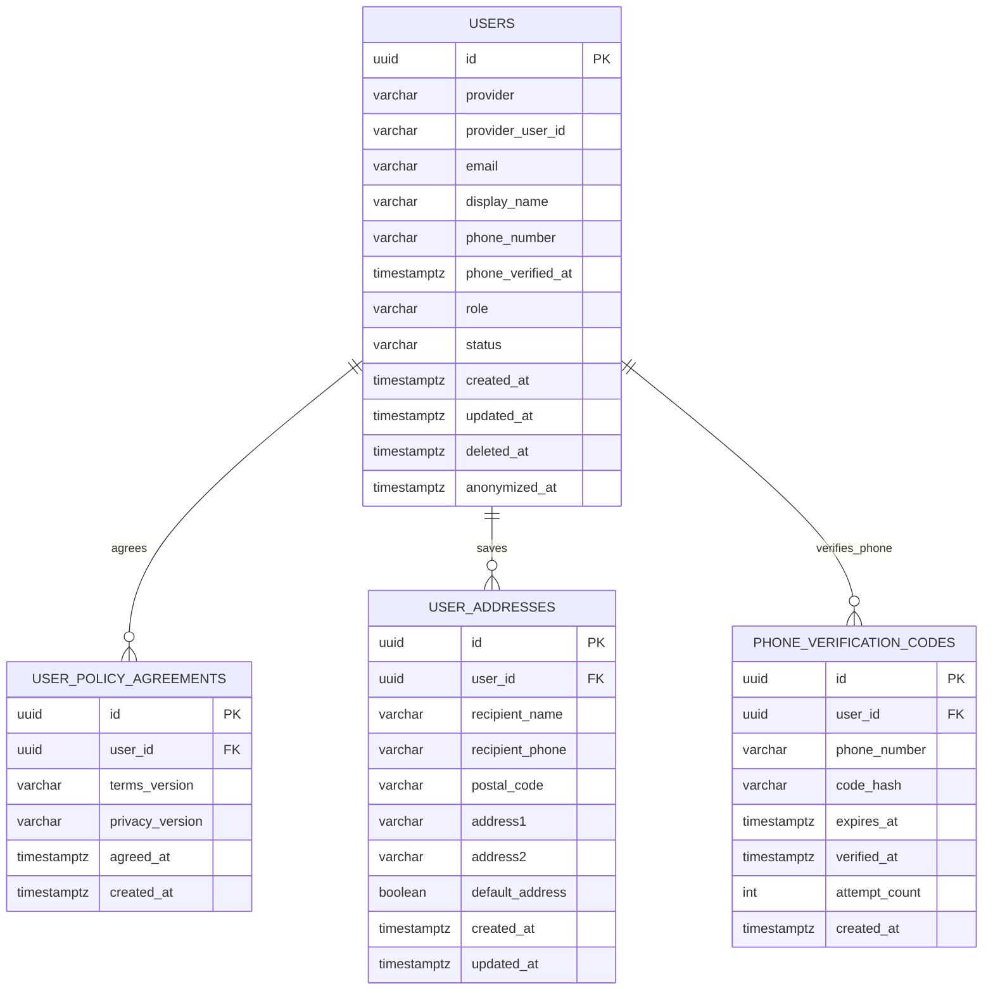
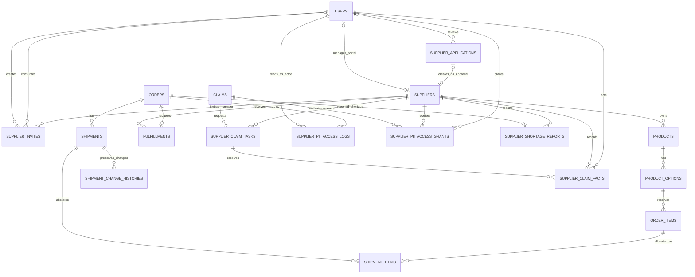

# MVP ERD

이 문서는 MVP 구현 전반의 데이터 모델 기준을 정리한다.

`docs/domain-model.md`는 도메인별 필드 후보와 모델링 이유를 설명하는 기준 문서이고, 이 문서는 구현자가 관계를 빠르게 확인하기 위한 ERD 기준 문서다.

## Status

- `users` table: implemented in `apps/api/src/main/resources/db/migration/V1__create_users.sql`.
- Catalog tables: implemented in `apps/api/src/main/resources/db/migration/V2__create_catalog.sql`.
- Cart tables: implemented in `apps/api/src/main/resources/db/migration/V3__create_cart.sql`.
- Checkout/order tables: implemented in `apps/api/src/main/resources/db/migration/V4__create_checkout_order.sql`.
- Payment attempt tables: implemented in `apps/api/src/main/resources/db/migration/V5__create_payment.sql`.
- DS-11 admin order queue is implemented with existing order, order item, payment, supplier, and user tables; no schema change was required.
- Fulfillment and admin order action history tables: implemented in `apps/api/src/main/resources/db/migration/V6__create_fulfillment.sql`.
- Shipment table: implemented in `apps/api/src/main/resources/db/migration/V7__create_shipment.sql`.
- Claim table: implemented in `apps/api/src/main/resources/db/migration/V8__create_claim.sql`.
- Refund table: implemented in `apps/api/src/main/resources/db/migration/V9__create_refund.sql`.
- User policy agreement table: implemented in `apps/api/src/main/resources/db/migration/V10__create_user_policy_agreements.sql`.
- User address table: implemented in `apps/api/src/main/resources/db/migration/V11__create_user_addresses.sql`.
- Policy document table: implemented in `apps/api/src/main/resources/db/migration/V17__create_policy_documents.sql`.
- Business profile and privacy processing item tables: implemented in `apps/api/src/main/resources/db/migration/V18__create_legal_disclosures.sql`.
- Customer required info and phone verification fields: implemented in `apps/api/src/main/resources/db/migration/V19__add_customer_required_info.sql`.
- Bank-transfer checkout/deposit and manual refund fields: implemented in `apps/api/src/main/resources/db/migration/V23__add_bank_transfer_payment_fields.sql`.
- User deletion timestamp fields: implemented in `apps/api/src/main/resources/db/migration/V26__add_user_deletion_fields.sql`.
- User referral fields: implemented in `apps/api/src/main/resources/db/migration/V28__add_user_referral_fields.sql`.
- Supplier portal onboarding, lifecycle, application/invite retention, fulfillment handover base and notification linkage: implemented in `apps/api/src/main/resources/db/migration/V39__add_supplier_portal_onboarding.sql` (`B-100`).
- Supplier portal catalog/review, pricing history and image cleanup: implemented in `apps/api/src/main/resources/db/migration/V40__add_supplier_product_catalog_foundation.sql` (`B-101`).
- Supplier portal inventory, reservation, payment-command replay and received-payment exceptions: implemented in `apps/api/src/main/resources/db/migration/V41__add_supplier_inventory_and_payment_reservations.sql` (`B-102`).
- Remaining legal/audit tables: planned.

## Modeling Rules

- MVP uses PostgreSQL.
- Primary keys use `UUID`.
- Customer-facing supplier information should be shown as delivery group, not raw supplier identity.
- The implemented B-102 catalog stores authoritative `TRACKED` inventory only for supplier-portal options that select quantity management; legacy options remain `UNTRACKED` and supplier-portal options may explicitly select `UNTRACKED`.
- Paid orders keep product name, option name, price, product summary, product detail reference, and product notice reference as snapshots.
- One checkout creates one `payment_group`.
- One `payment_group` may contain multiple delivery-group orders.
- One MVP order belongs to one delivery group.
- Refund can be scoped to a full payment group or one delivery-group order.
- Claim status and refund status are separate.
- Transactional notification history is separate from marketing consent.

## Current Implemented Schema

Current implementation intentionally stores social identity directly on `users`.

Conceptually, `User` and `SocialAccount` are separate in `docs/domain-model.md`, but MVP social-login-only policy and no account-merge scope allow the first implementation to keep provider identity on `users`. If account merge or multiple linked providers becomes necessary later, split `users` and `social_accounts` with a migration.

Additional implemented table groups:

- Account: `users`, `user_policy_agreements`, `user_addresses`
- Catalog: `suppliers`, `products`, `product_options`, `product_images`, `product_detail_blocks`, `product_notices`, `product_change_histories`
- Cart: `carts`, `cart_items`
- Checkout/order: `payment_groups`, `orders`, `order_items`, `order_policy_agreements`
- Payment: `payments`, `payment_events`

Deletion/rejoin note:

- B-014 implements account deletion by setting `users.status=DELETED`, recording `deleted_at` and `anonymized_at`, and anonymizing `provider_user_id` to `deleted-{userId}`.
- Same-provider rejoin creates a new active `users` row because OAuth lookup only reuses `ACTIVE` social identity rows.
- Legal-retention commerce records remain linked to the anonymized user row in MVP. A separate `LegalRetentionRecord` index remains planned for future retention-period automation.

## MVP Planned ERD

```mermaid
erDiagram
    USERS ||--o{ USER_ADDRESSES : saves
    USERS ||--o{ CARTS : owns
    USERS ||--o{ ORDERS : places
    USERS ||--o{ PAYMENT_GROUPS : pays
    USERS ||--o{ CLAIMS : requests
    USERS ||--o{ USER_POLICY_AGREEMENTS : agrees
    USERS ||--o{ MARKETING_CONSENTS : controls

    SUPPLIERS ||--o{ PRODUCTS : supplies
    SUPPLIERS ||--o{ DELIVERY_GROUPS : maps_to
    SUPPLIERS ||--o{ FULFILLMENTS : receives_orders

    PRODUCTS ||--o{ PRODUCT_OPTIONS : has
    PRODUCTS ||--o{ PRODUCT_IMAGES : has
    PRODUCTS ||--o{ PRODUCT_DETAIL_BLOCKS : has
    PRODUCTS ||--o{ PRODUCT_NOTICES : has
    PRODUCTS ||--o{ PRODUCT_CHANGE_HISTORIES : changes
    PRODUCT_OPTIONS ||--o{ PRODUCT_CHANGE_HISTORIES : changes

    CARTS ||--o{ CART_ITEMS : contains
    PRODUCTS ||--o{ CART_ITEMS : selected_product
    PRODUCT_OPTIONS ||--o{ CART_ITEMS : selected_option

    PAYMENT_GROUPS ||--o{ ORDERS : contains
    DELIVERY_GROUPS ||--o{ ORDERS : groups
    ORDERS ||--o{ ORDER_ITEMS : contains
    PRODUCTS ||--o{ ORDER_ITEMS : snapshotted_product
    PRODUCT_OPTIONS ||--o{ ORDER_ITEMS : snapshotted_option

    PAYMENT_GROUPS ||--o{ PAYMENTS : attempts
    PAYMENT_GROUPS ||--o{ PAYMENT_EVENTS : records
    PAYMENTS ||--o{ PAYMENT_EVENTS : emits

    ORDERS ||--o| FULFILLMENTS : fulfills
    ORDERS ||--o| SHIPMENTS : ships
    ORDERS o|--o{ REFUNDS : optionally_refunds
    PAYMENT_GROUPS ||--o{ REFUNDS : refunds
    PAYMENTS ||--o{ REFUNDS : executes
    ORDERS ||--o{ CLAIMS : has
    CLAIMS o|--o| REFUNDS : may_create

    ORDERS ||--o{ ORDER_STATUS_HISTORIES : records
    USERS ||--o{ ORDER_STATUS_HISTORIES : acts
    USERS ||--o{ ADMIN_ACTION_HISTORIES : performs

    USERS ||--o{ NOTIFICATION_LOGS : receives
    ORDERS ||--o{ NOTIFICATION_LOGS : triggers
    PAYMENT_GROUPS ||--o{ NOTIFICATION_LOGS : triggers
    CLAIMS ||--o{ NOTIFICATION_LOGS : triggers
    REFUNDS ||--o{ NOTIFICATION_LOGS : triggers

    POLICY_DOCUMENTS ||--o{ USER_POLICY_AGREEMENTS : accepted_as
    PAYMENT_GROUPS ||--o| ORDER_POLICY_AGREEMENTS : confirmed_by
    POLICY_DOCUMENTS ||--o{ PRIVACY_PROCESSING_ITEMS : includes
    USERS ||--o{ LEGAL_RETENTION_RECORDS : former_owner
```

## Account And Auth

### users

Implemented.

Purpose:

- Customer and admin account.
- Social identity anchor for Kakao, Google, and Naver.
- Admin permission source through `role`.

Current fields:

- `id`
- `provider`: `KAKAO` / `GOOGLE` / `NAVER`
- `provider_user_id`
- `email`: provider email when supplied, otherwise an internal placeholder such as `kakao-{providerUserId}@oauth.local`; do not use placeholder email as a customer contact address.
- `display_name`
- `phone_number`
- `phone_verified_at`
- `referral_code`: nullable, unique, lazily generated from first referral state read.
- `referred_by_user_id`: nullable self-reference to `users(id)`.
- `referred_at`: timestamp when the referrer code was registered.
- `role`: `CUSTOMER` / `ADMIN`
- `status`: `ACTIVE` / `DELETED`
- `created_at`
- `updated_at`

Open note:

- `docs/domain-model.md` mentions `SUSPENDED`, but current code has only `ACTIVE` and `DELETED`. Treat suspension as post-MVP until a decision adds it.
- B-050 referral tracking records only the referrer relationship. Reward, point, settlement, and fraud prevention models are future scope.

### user_policy_agreements

Implemented by DS-31.

Purpose:

- Records required terms and privacy agreement after first login or before checkout.
- Keeps agreement history by policy version pair.

Current fields:

- `id`
- `user_id`
- `terms_version`
- `privacy_version`
- `agreed_at`
- `created_at`

Constraints:

- Unique `(user_id, terms_version, privacy_version)` makes reposting the same required agreement idempotent.
- Checkout creation requires an agreement for the current required terms and privacy versions.

### user_addresses

Implemented by DS-32.

Purpose:

- Customer saved shipping address book.
- Order creation still stores shipping address snapshots on orders.

Key fields:

- `id`
- `user_id`
- `recipient_name`
- `recipient_phone`
- `postal_code`
- `address1`
- `address2`
- `default_address`
- `created_at`
- `updated_at`

Rules:

- Rows are scoped by `user_id`.
- First saved address becomes default automatically.
- Service logic keeps one default address when addresses remain.

### phone_verification_codes

Implemented by B-017.

Purpose:

- Stores optional legacy SMS OTP verification attempts.
- Code values are stored as hashes, not plaintext.

Current policy:

- Checkout requires a valid saved delivery phone number, not OTP completion.
- Existing rows and endpoints remain for compatibility and are not removed by B-074.

Current fields:

- `id`
- `user_id`
- `phone_number`
- `code_hash`
- `expires_at`
- `verified_at`
- `attempt_count`
- `created_at`

Rules:

- Latest code for `(user_id, phone_number)` is used for confirmation.
- Verification code has a short expiration window and retry limits.
- Successful verification stores the normalized number and verified timestamp on `users`.

### social_accounts

Deferred.

For MVP, social identity is collapsed into `users`. Split this table later only if account linking, account merge, or multiple providers per user are introduced.

## Catalog

Implemented by DS-6.

### suppliers

- `id`
- `name`
- `contact_name`
- `phone`
- `email`
- `memo`
- `status`: `ACTIVE` / `INACTIVE`
- `created_at`
- `updated_at`

Relationships:

- One supplier has many products.
- MVP uses one active delivery group per supplier with `shipping_fee = 0`.
- Multiple delivery groups per supplier are future scope unless a later decision adds independent delivery configuration.

### products

- `id`
- `supplier_id`
- `name`
- `summary`
- `source_price`: supplier cost, admin-only
- `source_item_no`: nullable unique supplier product number used by automated ordering, admin-only
- `source_available`: nullable last confirmed supplier sale availability, admin-only
- `source_synced_at`: nullable last source sync attempt time, admin-only
- `source_sync_error`: nullable last source sync failure, admin-only
- `source_url`: nullable supplier source URL, admin-only, maximum 2,000 characters
- `base_price`
- `minimum_order_quantity`: integer 1-99, not null, default 1
- `order_quantity_step`: integer 1-99, not null, default 1
- `category_code`: fixed product taxonomy code such as `PPE_SAFETY_HELMET`
- `status`: `ACTIVE` / `SOLD_OUT` / `HIDDEN` / `STOPPED`
- `compliance_status`: `PENDING` / `NOT_REQUIRED` / `VERIFIED` / `REJECTED`
- `thumbnail_image_url`: optional denormalized cache
- `created_at`
- `updated_at`

Rules:

- No real stock quantity.
- `base_price` is the customer-facing sale price. `source_price` and `source_url` must not be exposed by public customer APIs.
- Valid customer quantities are at least `minimum_order_quantity` and divisible by `order_quantity_step`.
- `source_url` accepts only `http` or `https`; the backend stores it for operator traceability and does not request the URL.
- Existing order item price snapshots are not changed when product source or sale prices change.
- One product has one `category_code`; category admin and multi-category mapping are future scope.
- Customer-visible sale requires product `ACTIVE` and option `ACTIVE`.
- Product activation additionally requires positive `base_price`, one canonical thumbnail, one active option, an active product notice, and compliance status other than `REJECTED`.
- Sale readiness is calculated from those current values and is not stored as a separate column.
- Canonical thumbnail data lives in `product_images` where `type = THUMBNAIL`.
- If `thumbnail_image_url` is kept on `products`, it is a cache updated from canonical thumbnail image metadata.

### product_options

- `id`
- `product_id`
- `name`
- `additional_price`
- `source_option_code`
- `source_additional_price`
- `source_stock_quantity`
- `sort_order`
- `status`: `ACTIVE` / `SOLD_OUT` / `STOPPED`
- `created_at`
- `updated_at`

Rules:

- `additional_price` is the customer-facing option price delta from product `base_price`.
- Source metadata is for admin/import traceability only and must not be exposed by public customer APIs.
- `source_stock_quantity` is a supplier-side reference value and is not used for checkout stock deduction in MVP.

### product_images

- `id`
- `product_id`
- `type`: `THUMBNAIL` / `GALLERY` / `DETAIL` (B-101)
- `image_url`
- `storage_object_key`: B-101 nullable, partial-unique when non-null
- `sort_order`
- `alt_text`
- `created_at`
- `updated_at`

Constraints:

- One thumbnail image per product.
- Up to ten gallery images per product.
- Implemented B-101 allows up to 50 `DETAIL` images. Supplier uploads use a server-generated key; legacy/external URLs keep a null key.
- DS-42 stores uploaded binary files in local product image storage and keeps URL/object-key metadata in `product_images`.

### product_detail_blocks

- `id`
- `product_id`
- `type`: `IMAGE` / `HTML`
- `image_url`
- `product_image_id`: B-101 nullable live FK to `product_images(id)`
- `html_content`
- `sort_order`
- `alt_text`
- `created_at`
- `updated_at`

Rules:

- HTML must be sanitized.
- Shipping, exchange, refund, and out-of-stock notices must not live only inside detail blocks.
- New supplier `IMAGE` blocks require an owned same-Product `ProductImage(type=DETAIL)` and derive the URL from it; arbitrary URL/key input is rejected. Existing legacy/admin URL blocks remain compatible with null `product_image_id`.
- A referenced DETAIL image cannot be removed independently. Product hard delete removes detail blocks before ProductImage rows and queues each server-owned key once.

### product_notices

Implemented by DS-6.

Purpose:

- Versioned product information notice and product-specific shipping, AS, return, and exchange information.
- Source for `OrderItem.productNoticeSnapshotId` or an equivalent immutable order snapshot reference.

Key fields:

- `id`
- `product_id`
- `version`
- `status`: `DRAFT` / `ACTIVE` / `ARCHIVED`
- `product_info_notice`
- `notice_rows`: nullable JSONB array of `{ label, value }` product information notice rows
- `shipping_info`
- `as_info`
- `return_exchange_info`
- `effective_from`
- `created_at`
- `updated_at`

Rule:

- Paid orders should reference the active notice version used at checkout time.
- `notice_rows` contains product information notice rows only; supplier identity and supplier trade terms are not public product detail fields.

## Cart

Implemented by DS-7.

### carts

- `id`
- `user_id`
- `created_at`
- `updated_at`

Constraints:

- `user_id` is unique. One customer has one current cart.
- `user_id` references `users(id)`.

### cart_items

- `id`
- `cart_id`
- `product_id`
- `product_option_id`
- `quantity`
- `created_at`
- `updated_at`

Constraints:

- `(cart_id, product_option_id)` is unique. Adding the same option increases quantity instead of creating a second row.
- `quantity` is constrained to 1 through 99.
- `cart_id` references `carts(id)` with cascade delete.
- `product_id` references `products(id)`.
- `product_option_id` references `product_options(id)`.

Rules:

- Guest carts are excluded from MVP.
- A product option can be added only while product status is `ACTIVE` and option status is `ACTIVE`.
- If product or option status changes after being added, the cart item remains but is marked unavailable.
- Cart items must revalidate product and option sellability before order creation.
- Cart item prices are displayed from current product and option prices. Final order price is snapshotted during order creation.

## Order And Checkout

Implemented by DS-8 except `delivery_groups`, which is deferred and derived from supplier for MVP.

### delivery_groups

- `id`
- `supplier_id`
- `display_name`
- `shipping_fee`
- `created_at`
- `updated_at`

Open note:

- Delivery group is supplier-backed but customer-facing. If it has no independent configuration, it may be derived from supplier during early implementation. Keep customer responses using delivery group terminology.

### orders

- `id`
- `order_number`
- `user_id`
- `supplier_id`
- `payment_group_id`
- `status`
- `recipient_name`
- `recipient_phone`
- `postal_code`
- `address1`
- `address2`
- `subtotal_amount`
- `shipping_fee`
- `discount_amount`
- `total_amount`
- `expires_at`
- `supplier_order_started_at`
- `address_locked_at`
- `address_locked_by_admin_id`
- `version`
- `created_at`
- `updated_at`

Status set:

- `PAYMENT_PENDING`
- `EXPIRED`
- `PAYMENT_EXCEPTION`
- `SUPPLIER_ORDER_PENDING`
- `SUPPLIER_ORDERED`
- `OUT_OF_STOCK`
- `SHIPPED`
- `DELIVERED`
- `CANCELLED`
- `REFUND_REQUESTED`
- `REFUNDED`

### order_items

- `id`
- `order_id`
- `product_id`
- `product_option_id`
- `supplier_id`
- `product_name`
- `product_summary`
- `product_detail_version`
- `product_notice_version`
- `option_name`
- `unit_price`
- `quantity`
- `line_amount`
- `source_item_no`
- `source_option_code`
- `source_unit_price`
- `created_at`
- `updated_at`

Rule:

- Product price, display text, and supplier purchase source values must not change for paid orders after product edits.

### order_policy_agreements

- `id`
- `payment_group_id`
- `user_id`
- `terms_version`
- `privacy_version`
- `order_policy_version`
- `cancellation_refund_policy_version`
- `out_of_stock_notice_version`
- `confirmed_notice_text`
- `confirmed_at`
- `created_at`

Open note:

- `docs/domain-model.md` uses `appliedOrderIds`. A join table is cleaner if strict relational modeling is needed. For MVP, payment-group ownership may be enough because a payment group contains the applied orders.

## Payment

### payment_groups

Implemented by DS-8 as the checkout payment aggregate. B-041 adds direct bank-transfer deposit metadata and manual admin deposit action fields.

- `id`
- `checkout_number`
- `user_id`
- `status`
- `total_amount`
- `approved_amount`
- `refundable_amount`
- `expires_at`
- `approved_at`
- `policy_confirmed_at`
- `bank_transfer_bank_name`
- `bank_transfer_account_number`
- `bank_transfer_account_holder`
- `bank_transfer_depositor_name`
- `bank_transfer_cash_receipt_notice`
- `deposit_confirmed_by_admin_id`
- `deposit_confirmed_at`
- `deposit_confirmation_reason`
- `actual_depositor_name`
- `actual_deposit_amount`
- `deposit_received_at`
- `deposit_transaction_reference`
- `deposit_mismatch_memo`
- `deposit_mismatch_recorded_by_admin_id`
- `deposit_mismatch_recorded_at`
- `unpaid_cancelled_by_admin_id`
- `unpaid_cancelled_at`
- `unpaid_cancel_reason`
- `version`
- `created_at`
- `updated_at`

### payments

Implemented by DS-9.

- `id`
- `payment_group_id`
- `provider`: 현재 생성값은 `BANK_TRANSFER`이며 `TOSS_PAYMENTS`는 과거 데이터 조회 호환용 enum 값으로만 보존한다.
- `provider_payment_key`
- `method`: `CARD` / `EASY_PAY` / `TRANSFER` / `BANK_TRANSFER`
- `status`
- `requested_amount`
- `approved_amount`
- `approved_at`
- `exception_reason`
- `idempotency_key`
- `failure_code`
- `failure_message`
- `provider_cancel_transaction_key`
- `cancel_requested_at`
- `cancelled_at`
- `raw_provider_status`
- `last_synced_at`
- `created_at`
- `updated_at`

Relationship note:

- One `payment_group` represents one bank-transfer deposit. Keep `payments` as `1:N` to preserve historical payment records without changing the aggregate.
- The three deposit-mismatch memo fields are retained as the B-068 compatibility record. Implemented B-102 reuses the actual depositor/amount/received-at/transaction-reference fields for an identified mismatched receipt and sets `refundable_amount` to that actual amount while leaving `total_amount` immutable and approved amount/time null.

### payment_events

Implemented by DS-9 for payment confirmation events.

- `id`
- `payment_id`
- `payment_group_id`
- `order_id`: nullable since V5; order-scoped command events retain the target Order id, while payment-group-scoped amount-mismatch and its manual-refund-completion command events keep it null
- `provider_payment_key`
- `event_type`
- `idempotency_key`
- `raw_payload`
- `result_message`
- `received_at`
- `processed_at`
- `created_at`

Implemented V41 adds nullable `command_type`, `request_hash`, and ADMIN-safe immutable JSONB `result_snapshot` for normal confirmation, amount mismatch, portal late-deposit and every received-payment-exception `MANUAL_REFUND_COMPLETED` command event. These rows share a partial unique `(payment_group_id, idempotency_key)` where the key and command type are non-null.

## Fulfillment, Shipment, Refund, Claim

### fulfillments

- `id`
- `order_id`
- `supplier_id`
- `status`: `PENDING` / `ORDERED` / `OUT_OF_STOCK` / `CANCELLED`
- `supplier_order_started_at`
- `supplier_order_number`
- `ordered_address_snapshot`
- `ordered_by_admin_id`
- `ordered_at`
- `expected_ship_date`
- `supplier_response_memo`
- `out_of_stock_reason`
- `purchase_provider`
- `purchase_status`: `READY` / `PROCESSING` / `RECONCILIATION_REQUIRED` / `ORDERED` / `FAILED` / `CANCEL_REQUESTED` / `CANCELLED`
- `expected_source_amount`
- `actual_source_amount`
- `request_fingerprint`
- `last_purchase_error`
- `purchase_synced_at`
- `supplier_cancel_status`
- `created_at`
- `updated_at`

Constraints and indexes:

- Unique `order_id`
- Indexes on `order_id`, `supplier_id`, and `status`
- Index on `purchase_status`
- Unique non-null `supplier_order_number`

### supplier_purchase_attempts

- `id`
- `fulfillment_id`
- `action`: `ORDER` / `RECONCILE` / `CANCEL`
- `status`: `STARTED` / `SUCCEEDED` / `FAILED` / `UNKNOWN`
- `request_fingerprint`
- `external_order_number`
- `expected_amount`
- `actual_amount`
- `failure_code`
- `failure_message`
- `created_at`
- `completed_at`

Rule:

- A response loss after `setOrder` is recorded as `UNKNOWN` and requires purchase-order reconciliation before retry.

### admin_order_action_histories

- `id`
- `order_id`
- `admin_user_id`
- `action_type`: `BANK_TRANSFER_DEPOSIT_CONFIRMED` / `BANK_TRANSFER_UNPAID_CANCELLED` / `BANK_TRANSFER_DEPOSIT_MISMATCH_RECORDED` / `MANUAL_REFUND_COMPLETED` / `SUPPLIER_WORK_START` / `SUPPLIER_ORDER_COMPLETED` / `OUT_OF_STOCK` / `SHIPMENT_STARTED` / `SHIPMENT_MANUAL_CORRECTION`
- `before_status`
- `after_status`
- `reason`
- `created_at`

### order_status_histories

- `id`
- `order_id`
- `actor_user_id`
- `action_type`
- `from_status`
- `to_status`
- `guard_result`
- `side_effect_summary`
- `reason`
- `created_at`

### shipments

- `id`
- `order_id`
- `carrier`
- `tracking_number`
- `status`: `READY` / `SHIPPED` / `DELIVERED`
- `shipped_at`
- `delivered_at`
- `tracking_synced_at`
- `tracking_sync_failure_reason`
- `manual_override`
- `manual_correction_reason`
- `manual_corrected_by_admin_id`
- `manual_corrected_at`
- `created_at`
- `updated_at`

MVP rule:

- One order has at most one shipment.

Constraints and indexes:

- Unique `order_id`
- Indexes on `order_id`, `status`, and `(carrier, tracking_number)`

### refunds

- `id`
- `payment_group_id`
- `order_id`
- `payment_id`
- `reason`
- `status`
- `refund_amount`
- `refund_scope`: `PAYMENT_GROUP` / `DELIVERY_GROUP_ORDER`
- `provider_payment_key`
- `provider_cancel_transaction_key`
- `idempotency_key`
- `failure_code`
- `failure_message`
- `raw_provider_status`
- `reviewed_by_admin_id`
- `admin_review_reason`
- `reviewed_at`
- `manual_refunded_by_admin_id`
- `manual_refunded_at`
- `manual_refund_reason`
- `manual_refund_bank_name`
- `manual_refund_account_number`
- `manual_refund_account_holder`
- `manual_refund_transferred_at`
- `manual_refund_transaction_reference`
- `requested_at`
- `completed_at`
- `failed_at`
- `created_at`
- `updated_at`

Implemented DS-15 scope:

- One refund per delivery-group order in MVP.
- Refunds are created for approved cancellation and supplier out-of-stock.
- Bank-transfer manual refund completion fields are stored on the refund. Historical PG fields remain for existing data compatibility.

Implemented B-102 payment-group refund constraints (V41):

- `refund_scope=DELIVERY_GROUP_ORDER` requires non-null `order_id`; `refund_scope=PAYMENT_GROUP` requires null `order_id` and non-null `payment_group_id`/`payment_id`.
- `refund_amount > 0` is required. A partial unique index on `payment_group_id WHERE refund_scope='PAYMENT_GROUP'` permits exactly one group refund, while the existing nullable unique `order_id` continues to prevent duplicate delivery-group refunds.
- V41 adds unique `(id,payment_group_id)` keys to `payments` and `orders`, then composite foreign keys `refunds(payment_id,payment_group_id) -> payments(id,payment_group_id)` and `refunds(order_id,payment_group_id) -> orders(id,payment_group_id)`. The nullable Order composite applies only when `order_id` is present. Service guards under the same aggregate locks also require the linked received Payment and every Order target to belong to the locked PaymentGroup before creation or completion.
- `PAYMENT_AMOUNT_MISMATCH` is the only B-102 reason using `PAYMENT_GROUP`: its amount is `payment_groups.actual_deposit_amount`, not the expected total or a sum allocated across Orders.
- Before changing nullability/indexes and adding composite foreign keys, the V41 migration preflight scans existing `refund_scope=PAYMENT_GROUP`, null/duplicate target rows, nonpositive amounts and cross-PaymentGroup payment/order links. Any incompatible row blocks migration for explicit data reconciliation rather than silently choosing an anchor Order, relinking money or deleting history.

### claims

- `id`
- `order_id`
- `user_id`
- `claim_type`: `CANCEL` / `RETURN` / `EXCHANGE`
- `claim_reason`: `SIMPLE_CHANGE_OF_MIND` / `DEFECT` / `WRONG_DELIVERY` / `DIFFERENT_FROM_PRODUCT_INFO` / `DELIVERY_ISSUE`
- `status`: `REQUESTED` / `UNDER_REVIEW` / `EVIDENCE_REQUESTED` / `APPROVED` / `REJECTED` / `RETURN_WAITING` / `RETURN_RECEIVED` / `REFUND_PROCESSING` / `EXCHANGE_SHIPPING` / `COMPLETED` / `WITHDRAWN`
- `requested_action`: `REFUND` / `EXCHANGE`
- `customer_memo`
- `reviewed_by_admin_id`
- `admin_review_reason`
- `reviewed_at`
- `return_received_by_admin_id`
- `return_received_at`
- `return_received_memo`
- `refund_id` -> `refunds.id`
- `completed_at`
- `created_at`
- `updated_at`

### claim_evidences

- `id`
- `claim_id` -> `claims.id`
- `file_url`
- `object_key`
- `original_filename`
- `content_type`
- `size_bytes`
- `uploaded_at`

Rule:

- One claim can have multiple evidence image files.
- Evidence files use the same upload extension and image magic-byte validation as product images.
- Evidence is required at creation for seller-fault claim reasons: `DEFECT`, `WRONG_DELIVERY`, `DIFFERENT_FROM_PRODUCT_INFO`, `DELIVERY_ISSUE`.

Implemented claim scope:

- Self-service eligible cancellation creates an approved `CANCEL` claim and moves the order to `REFUND_REQUESTED`.
- Post-supplier-work cancellation creates a requested `CANCEL` claim for admin review.
- Post-delivery return/exchange claims create requested `RETURN` or `EXCHANGE` claims. Implemented by DS-37.
- Return approval moves the claim to `RETURN_WAITING`; exchange approval keeps `APPROVED` until exchange shipment handling.
- Delivered return refund completion links `claims.refund_id` to the created refund, moves `RETURN_RECEIVED -> REFUND_PROCESSING -> COMPLETED`, and keeps rejected return claims on `DELIVERED` orders. Implemented by B-044.
- Customer claim list/detail and evidence image storage are implemented by B-015.

Rule:

- Claim approval does not mean refund completion. Refund completion requires actual manual bank-transfer completion.

## Policy, Legal, Audit, Notification

Policy/legal tables:

- `policy_documents`
- `user_policy_agreements`
- `business_profiles`
- `privacy_processing_items`
- `customer_inquiries`
- `marketing_consents`
- `legal_retention_records`

Business profile and privacy processing item public APIs read active DB rows. Admin-managed editing remains planned.

### policy_documents

- `id`
- `type`: `TERMS_OF_SERVICE` / `PRIVACY_POLICY` / `SHIPPING_POLICY` / `CANCELLATION_REFUND_POLICY` / `OUT_OF_STOCK_NOTICE`
- `version`
- `title`
- `content`
- `effective_from`
- `status`: `DRAFT` / `ACTIVE` / `ARCHIVED`
- `created_at`
- `updated_at`

DS-41 implements persisted managed policy versions. Unique `(type, version)` prevents duplicate versions, and activation archives the previous active policy of the same type.

Public policy pages for `shipping`, `cancellation-refund`, and `stock-risk` are backed by active `policy_documents` rows.

### business_profiles

- `id`
- `company_name`
- `representative_name`
- `business_registration_number`
- `mail_order_sales_registration_number`
- `mail_order_sales_registration_authority`
- `business_address`
- `customer_center_phone`
- `customer_center_email`
- `customer_center_hours`
- `privacy_officer_name`
- `privacy_officer_email`
- `privacy_officer_phone`
- `hosting_provider`
- `active`
- `effective_from`
- `created_at`
- `updated_at`

Rule:

- Public business disclosure reads the latest active row by `effective_from`.

### privacy_processing_items

- `id`
- `category`
- `collected_items`
- `purpose`
- `retention_period`
- `processor_name`
- `processor_purpose`
- `third_party_recipient`
- `third_party_purpose`
- `sort_order`
- `active`
- `created_at`
- `updated_at`

Rule:

- Public privacy processing table reads active rows ordered by `sort_order`.

### customer_inquiries

- `id`
- `customer_name`
- `email`
- `phone`
- `subject`
- `message`
- `status`
- `consent_policy_version`
- `consented_at`
- `retention_expires_at`
- `admin_memo`
- `answer`
- `handled_by_admin_id`
- `answered_at`
- `closed_at`
- `created_at`
- `updated_at`

Rule:

- Public customers can create inquiries without login after required consent.
- Admin users manage status, memo, and the latest answer.
- Existing rows migrated by V30 remain `RECEIVED` with null consent evidence rather than fabricated consent.
- Indexes support status queues, email rate limiting, and three-year retention cleanup.
- Retention cleanup clears inquiry email and answer content from notification logs before deleting the inquiry row.

Audit/notification tables:

- `order_status_histories`
- `admin_order_action_histories`
- `product_change_histories`
- `notification_logs`

### notification_logs

- `id`
- `user_id`
- `order_id`
- `payment_group_id`
- `claim_id`
- `refund_id`
- `customer_inquiry_id`: nullable, customer inquiry answer email reference; `ON DELETE SET NULL`
- `type`: `PAYMENT_PENDING` / `PAYMENT_COMPLETED` / `PAYMENT_EXCEPTION` / `OUT_OF_STOCK` / `SHIPMENT_STARTED` / `DELIVERY_COMPLETED` / `DELAY_NOTICE` / `CLAIM_STATUS_CHANGED` / `REFUND_COMPLETED` / `CUSTOMER_INQUIRY_ANSWERED` / `MARKETING`
- `channel`: `EMAIL` / `ORDER_DETAIL` / `SMS` / `KAKAO_ALIMTALK` / `PUSH`
- `transactional`
- `status`: `PENDING` / `SENT` / `FAILED` / `SKIPPED`
- `recipient`
- `template_key`
- `payload_snapshot`
- `failure_reason`
- `sent_at`
- `created_at`
- `updated_at`

Rules:

- Transactional notifications are not marketing notifications.
- Transactional SMS logs start as `PENDING` and then record `SENT`, `FAILED`, or `SKIPPED`.
- Order-related notification recipients come from `orders.recipient_phone`.
- Admin order actions must be action-based, not arbitrary status mutation.
- DS-44 exposes admin reads for `order_status_histories` and `admin_order_action_histories`.
- Product change history records product, option, image, detail block, notice, and supplier changes. Field-level diffs remain after MVP.

## Supplier Portal ERD (`B-100`~`B-104` Implemented; `B-105` Planned)

Status: V39 implements the `B-100` supplier, application, invitation, lifecycle, fulfillment-handover base and notification linkage schema. V40 implements the `B-101` catalog/review, pricing-history and image-cleanup schema. V41 implements the `B-102` inventory, reservation, payment-command replay and received-payment exception schema. V42 implements the `B-103` delivery memo, Claim PII grant, access-log and operational-email retention indexes. V43 implements the `B-104` plural Shipment/allocation/history schema under the same expand-contract principle. `B-098` contract history/command/scheduler and `B-105` schema remain Planned. Existing legacy rows remain valid through the expand-contract migrations.

B-100 also implements `SUPPLIER_APPLICATION_PRIVACY` in `policy_documents.type`. The supplier application service reads the current ACTIVE row and validates the submitted version before persisting canonical consent evidence.

### suppliers additions (Implemented B-100, V39)

- `manager_user_id`: nullable FK to `users(id)`, unique
- `portal_enrolled_at`: nullable immutable first-enrollment marker; existing legacy rows backfill null
- `portal_status`: `DISABLED` / `PENDING_ACTIVATION` / `ACTIVE` / `SUSPENDED`, not null
- `contact_email_verified_at`: nullable
- `portal_contract_status`: `UNVERIFIED` / `VERIFIED` / `EXPIRED` / `REVOKED`, not null
- `portal_contract_version`: nullable
- `portal_contract_effective_at`: nullable
- `portal_contract_expires_at`: nullable
- `portal_contract_verified_at`: nullable
- `portal_contract_verified_by_admin_id`: nullable FK to `users(id)`
- `contact_retention_expires_at`: nullable; required after eligible permanent relationship closure
- `contact_anonymized_at`: nullable

Rules and compatibility:

- Existing `status` keeps its catalog/trade meaning `ACTIVE` / `INACTIVE`; `portal_status` is an independent access lifecycle.
- Existing supplier rows backfill `portal_status=DISABLED`, `manager_user_id=null`, and `portal_enrolled_at=null`. CREATE_NEW/LINK_EXISTING sets the marker once; permanent DISABLED retains it so legacy PATCH and contract-free sales activation cannot treat that row as never enrolled.
- Normalized contact-email uniqueness is partial to `portal_enrolled_at is not null` and non-anonymized rows, so V39 remains compatible with pre-existing legacy duplicate email data. Application/link/contact commands still query all trimmed case-insensitive Supplier emails and reject a current collision before enrolling a portal supplier.
- Existing supplier rows backfill `portal_contract_status=UNVERIFIED`. B-100 owns these denormalized columns/default and fail-closed sales guard; B-098 depends on them and owns history/command/evidence/expiry index/scheduler. A portal-enrolled supplier cannot move sales to ACTIVE or expose portal products unless status is VERIFIED, effective time has arrived, and expiry has not passed.
- One supplier has at most one manager and one user manages at most one supplier. No `supplier_memberships` or team table is planned for B-100.
- Dynamic `ROLE_SUPPLIER` requires an ACTIVE user, `portal_status=ACTIVE`, the manager FK, and the matching supplier tenant at request time. A terminal or already-overdue VERIFIED contract suppresses this authority immediately; initial UNVERIFIED onboarding may still use non-PII catalog surfaces. Existing `status` independently gates new catalog sales/checkouts, so an INACTIVE supplier manager may finish already-paid work only while the contract remains time-valid.
- Portal suspension writes only `portal_status=SUSPENDED`; manager disconnection clears `manager_user_id` and writes `portal_status=PENDING_ACTIVATION`. Both keep existing paid portal evidence but put unfinished work in a Coreable takeover queue that reactivation does not silently hand back. Required `sales_action=KEEP|PAUSE` changes existing `status` only when PAUSE is explicit. Implemented B-103 creates `COREABLE_MANUAL` fulfillment for new paid work while KEEP leaves sales active but portal access unavailable.
- Changing `email` clears `manager_user_id` and `contact_email_verified_at`, sets `portal_status=PENDING_ACTIVATION`, revokes open invites, and requires a new invite before operational email or portal activation. This command also requires an explicit `sales_action`; Implemented B-103 uses the same KEEP fallback.
- Explicit `sales-status` changes existing `status` independently of portal state and never restores handed-over work. When LINK_EXISTING approves an application, it sets the selected disabled Supplier contact email to the application's normalized contact email and keeps `contact_email_verified_at=null` until that exact invite recipient completes callback.
- `SUSPENDED -> ACTIVE` portal reactivation requires the retained active manager, verified contact email, and time-valid VERIFIED contract. Contract re-verification alone changes none of portal status, sales status, or handed-over ownership.
- Production activation first configures a concrete B-098/privacy-notice post-relationship duration. Permanent `portal_status=DISABLED`, trade `status=INACTIVE`, and no open Fulfillment/Claim/Refund set `contact_retention_expires_at`. At the deadline a scheduler locks Supplier and rechecks all lifecycle/open-work predicates; new open work clears/defers the deadline, and only continuing eligibility permits contact name/phone/email/memo plus approved-application duplicate PII/replay cleanup. Order/contract legal records follow their separate retention rules.

### supplier_portal_action_histories (Implemented B-100, V39)

- `id`
- `supplier_id`: FK to `suppliers(id)`
- `actor_admin_id`: FK to `users(id)`
- `action`: `INVITE_REISSUED` / `INVITE_REVOKED` / `PORTAL_SUSPENDED` / `PORTAL_REACTIVATED` / `PORTAL_DISABLED` / `MANAGER_DISCONNECTED` / `CONTACT_EMAIL_CHANGED` / `SALES_STATUS_CHANGED`
- `before_portal_status` / `after_portal_status`
- `before_sales_status` / `after_sales_status`
- `sales_action`: nullable `KEEP` / `PAUSE`
- `reason`: required PII-free operational text before relationship cleanup, nullable afterward
- `request_hash`: nullable after relationship cleanup; server-keyed HMAC when contact email is in the command
- `idempotency_key`: nullable after relationship cleanup
- `result_snapshot`: nullable ADMIN-safe canonical JSONB result; cleared at relationship cleanup
- `created_at`

Rows are append-only except explicit relationship-retention anonymization of reason/key/hash/result. Partial unique `(supplier_id,idempotency_key)` where key is non-null makes commands replay-safe; the same key with a different request HMAC is rejected. Lifecycle mutation and history insert share the Supplier lock. Contact/reissue/disable and Kakao callback use `Supplier -> Invite(id) -> User/manager -> Fulfillment`; callback may first read the digest without a lock only to resolve Supplier id, then revalidates everything under this order. Payment uses PaymentGroup -> Suppliers -> Products -> every affected ProductOption including UNTRACKED -> Orders/Fulfillments, each group by id. Catalog/inventory writers use Supplier when needed, then Product -> Option, and never acquire Supplier after Product.

### supplier_portal_contract_histories (Planned B-098)

- `id`
- `supplier_id`: FK to `suppliers(id)`
- `status`: `VERIFIED` / `EXPIRED` / `REVOKED`
- `contract_version`: not null; new version for VERIFIED, target current version for EXPIRED/REVOKED
- `effective_at`
- `expires_at`: nullable
- `evidence_reference`: ADMIN-only non-secret registry reference
- `acted_by_admin_id`: nullable FK to `users(id)` for scheduler expiry
- `reason`
- `request_hash`: nullable for scheduler
- `idempotency_key`: nullable for scheduler
- `result_snapshot`: nullable ADMIN-safe immutable JSONB result
- `created_at`

Partial unique `(supplier_id,idempotency_key)` where key is non-null gives deterministic ADMIN replay. Partial unique `(supplier_id,contract_version) where status='VERIFIED'` prevents verified-version reuse, and partial unique `(supplier_id,contract_version) where status in ('EXPIRED','REVOKED')` permits at most one terminal event for that version. Index `(status,expires_at)` drives expiry. Every admin command carries `expected_current_contract_version`; VERIFIED requires it to equal current (including null initially), plus `effective_at <= now`, null/future `expires_at`, and a new version/evidence. EXPIRED/REVOKED require current Supplier status VERIFIED and the non-null target current version. Scheduler locks Supplier, compares candidate version/expiry/status again, and no-ops if terminal processing or re-verification already won. Terminal/lazy expiry sets sales INACTIVE, changes ACTIVE portal to SUSPENDED while retaining the manager, revokes an open invite, and hands all still-SUPPLIER-owned open portal Fulfillments to COREABLE with contract reason in the same transaction; PENDING_ACTIVATION stays unauthorized but loses its invite. Paid-work and Claim-grant reads independently require time-valid VERIFIED. Re-verification never reactivates portal/sales or restores ownership. Current fields update with history; evidence never enters supplier/customer projections.

### supplier_applications (Implemented B-100, V39)

- `id`
- `supplier_name`: nullable after retention anonymization
- `contact_name`: nullable after retention anonymization
- `contact_email`: nullable after retention anonymization
- `normalized_contact_email`: nullable after retention anonymization
- `contact_phone`: optional, nullable after retention anonymization
- `memo`: optional, nullable after retention anonymization
- `idempotency_key`: nullable after retention anonymization
- `request_hash`: nullable server-keyed HMAC, never a plain contact-payload hash
- `consent_policy_version`
- `consented_at`
- `status`: `SUBMITTED` / `APPROVED` / `REJECTED` / `EXPIRED`
- `reviewed_by_admin_id`: nullable FK to `users(id)`
- `review_reason_code`: nullable allowlisted code until terminal transition
- `review_reason`: nullable temporary PII-free internal text
- `reviewed_at`: nullable until review
- `approved_supplier_id`: nullable unique FK to `suppliers(id)`
- `review_action`: nullable `APPROVE` / `REJECT`
- `approval_mode`: nullable `CREATE_NEW` / `LINK_EXISTING`
- `requested_existing_supplier_id`: nullable FK to `suppliers(id)`
- `review_idempotency_key`: nullable after retention cleanup
- `review_request_hash`: nullable server-keyed HMAC of canonical review command
- `review_result_snapshot`: nullable immutable ADMIN-safe JSONB result
- `retention_expires_at`: initially `created_at+90 days`; reset to `reviewed_at+90 days` for REJECTED, null while APPROVED operational retention is active
- `anonymized_at`: nullable
- `created_at`
- `updated_at`

Constraints and indexes:

- Index `(status, created_at)` for the admin review queue.
- Index `retention_expires_at` for cleanup.
- Partial unique index on `normalized_contact_email` where `status in ('SUBMITTED','APPROVED')`, plus partial unique `idempotency_key` where non-null; identical HMAC returns the existing application and a changed payload under the same key returns a generic conflict. A new submit locks the normalized-email boundary, lazily changes an overdue matching SUBMITTED row to EXPIRED with the same cleanup as the scheduler, and only then evaluates this active/approved uniqueness constraint, so scheduler lag cannot block a legitimate resubmission.
- Review locks the application and atomically stores terminal status, action, key/hash, approval mode/requested target, actor/reason and immutable result. Only the same action/key/hash returns that result; a different key/payload or opposite action conflicts. Approval writes one `approved_supplier_id` and cannot create a second Supplier/invite.
- Human review permits only `SUBMITTED -> APPROVED|REJECTED`; the scheduler uses `SUBMITTED -> EXPIRED` at the stored deadline. Review locks the row and requires `now < retention_expires_at`; otherwise it first applies the same EXPIRED cleanup and returns `APPLICATION_EXPIRED`, so scheduler lag cannot review expired data. All terminal states reject review changes. A newly approved supplier starts with existing `status=INACTIVE`, `portal_contract_status=UNVERIFIED`, and `portal_status=PENDING_ACTIVATION`. Linking an existing supplier requires explicit `approval_mode=LINK_EXISTING` and admin-selected `approved_supplier_id`, no manager/invite/application link/portal lifecycle history, and `portal_status=DISABLED`; it is only for a never-enrolled legacy row, not a permanently disabled portal supplier. It preserves trade status but replaces contact email with the approved application's normalized email and clears verification before invitation. Portal-managed product saleability always adds the time-valid current contract VERIFIED guard.
- When `APP_SUPPLIER_PORTAL_ENABLED=false`, a new APPROVE fails with `SUPPLIER_PORTAL_NOT_RELEASED` after ADMIN/application scope plus stored key/hash/result replay lookup but before application, Supplier, or invite mutation. An identical completed-command replay returns its token-free result without dispatch; REJECT and retention cleanup remain available.
- A SUBMITTED row reaching its initial deadline becomes EXPIRED and is cleaned. REJECTED resets the deadline to review +90 days. Their cleanup nulls supplier/contact names, email/normalized email/phone/memo, internal review reason, submit/review idempotency keys, request HMACs and review result snapshot while preserving consent version/time, terminal status, review action/mode, allowlisted reason code, reviewer/time, and timestamps. APPROVED contact data is copied into the Supplier operational record and its application duplicate/replay material is cleaned only under the same B-098 post-relationship deadline. Post-cleanup replay is a new application; CREATE_NEW refuses a current Supplier-contact collision rather than auto-matching or creating a duplicate.
- Review reason code is `APPLICATION_APPROVED`, `INCOMPLETE_INFORMATION`, `OUT_OF_SCOPE`, `POLICY_NOT_MET`, or `DUPLICATE_OR_EXISTING_RELATIONSHIP`; approval requires the first and rejection permits only the others. Internal review reason rejects PII.
- Supplier or User matching is never inferred from equal name/email values.

### supplier_invites (Implemented B-100, V39)

- `id`
- `supplier_id`: FK to `suppliers(id)`
- `recipient_email`: nullable after terminal retention cleanup
- `token_digest`: unique
- `issuance_idempotency_key`: nullable after terminal retention cleanup
- `issuance_request_hash`: nullable server-keyed HMAC when recipient email is included
- `expires_at`
- `consumed_at`: nullable
- `consumed_by_user_id`: nullable FK to `users(id)`; cleared at the B-098 relationship-retention deadline
- `revoked_at`: nullable
- `revoked_by_admin_id`: nullable FK to `users(id)`
- `revocation_reason_code`: nullable allowlist `DELIVERY_FAILED` / `INVITE_EXPIRED` / `RECIPIENT_CHANGED` / `ADMIN_REISSUE`; required for admin reissue/revoke, no free text
- `recipient_retention_expires_at`: terminal time +30 days
- `recipient_anonymized_at`: nullable
- `created_by_admin_id`: FK to `users(id)`
- `created_at`

Constraints and transaction rules:

- A partial unique index on `supplier_id` where `consumed_at is null and revoked_at is null` permits only one open invite. Reissue first revokes the previous row, including an expired open row.
- Partial unique `(supplier_id, issuance_idempotency_key)` where key is non-null protects approval issuance and explicit reissue during the retention window. Approval uses an `application:` namespace; reissue derives a distinct `reissue:` server-HMAC namespace from the command key so a caller cannot replay a revoked approval invite accidentally. Identical command key/HMAC replay returns the stored action result; a key reused with another payload is rejected. After scoped replay lookup, only a new reissue key plus an allowlisted reason code and locked Supplier with `portal_status=PENDING_ACTIVATION`, null manager, non-null contact email, and null verification time revokes/replaces an open row. ACTIVE/SUSPENDED/DISABLED or manager-bound rows reject the command.
- Only a digest of a minimum 256-bit token is stored. The raw token must not enter SQL, application logs, or access logs. This is the sole pre-verification contact email and contains only the token/link and generic connection instructions.
- The default expiry is seven days.
- Invitation NotificationLog payload stores token-free metadata only (`supplier_invite_id`, template, expiry, delivery state). The raw fragment link exists only in ephemeral after-commit sending memory; a crash or delivery failure requires a new reissue key/token rather than generic resend.
- After scoped key/hash/result replay lookup, every new approval issuance, reissue, and post-contact-change issuance requires the global supplier-portal flag before mutating an invite. An identical completed-command replay returns only stored token-free metadata. Dispatch rechecks the flag immediately before sending and finalizes `SKIPPED/PORTAL_NOT_RELEASED` when it closed after commit; recovery after reopening uses a new-key reissue, while lifecycle suspension/disable and retention cleanup are not blocked.
- Thirty days after consumed, revoked, or expired state, cleanup nulls `recipient_email`, issuance idempotency key/HMAC, and the linked NotificationLog recipient and records `recipient_anonymized_at`; digest, terminal timestamps, delivery state, and actor evidence remain.
- Kakao callback uses an initial non-locking digest lookup only to resolve Supplier id, then locks `Supplier -> Invite(id) -> User/manager` and rechecks digest, binding/state, expiry, revoked/consumed state, portal state, recipient, and manager uniqueness. Contact change, disable and reissue use the same Supplier-before-Invite order.
- User lookup/create, manager binding, contact email verification, `portal_status=ACTIVE`, and invite consumption commit atomically. Concurrent callbacks allow one winner; callback/lifecycle deadlock races are tested.

### product review and inventory additions (B-101/B-102 Implemented)

`products` (Implemented B-101):

- `management_channel`: `COREABLE` / `SUPPLIER_PORTAL`, not null
- `version`: optimistic aggregate version, not null
- `first_submitted_at`: nullable immutable first portal submit timestamp
- `pricing_policy_id_applied`: nullable FK to `pricing_policies(id)` during backfill
- `pricing_policy_version_applied`: nullable during backfill
- `review_status`: nullable for legacy rows; portal values are `DRAFT` / `AUTO_APPROVED` / `REVIEW_REQUIRED` / `SUPPLEMENT_REQUESTED` / `APPROVED` / `REJECTED`
- `review_reason_code`: nullable allowlisted supplier-facing code; required for `REVIEW_REQUIRED`, `SUPPLEMENT_REQUESTED`, and `REJECTED`
- `supplier_review_message`: nullable supplier-safe single-line PII-free plain text up to 500 characters, required for `SUPPLEMENT_REQUESTED` and `REJECTED`; never stores an internal admin note, contact/customer identifier, or link

`product_options` (Implemented B-102, V41):

- `supplier_availability`: `AVAILABLE` / `UNAVAILABLE`, not null, compatibility default `AVAILABLE`
- `inventory_mode`: `TRACKED` / `UNTRACKED`, not null, compatibility default `UNTRACKED`
- `on_hand_quantity`: nullable
- `reserved_quantity`: not null, default 0
- `inventory_version`: not null, default 0; supplier inventory and reservation lifecycle changes increment it

`order_items` (Implemented B-102, V41):

- `management_channel_snapshot`: `COREABLE` / `SUPPLIER_PORTAL`, not null, compatibility default `COREABLE`
- `inventory_mode_snapshot`: `TRACKED` / `UNTRACKED`, not null, compatibility default `UNTRACKED`
- `reservation_status`: `NOT_APPLICABLE` / `HELD` / `CONSUMED` / `RELEASED`, not null, compatibility default `NOT_APPLICABLE`
- `reserved_at`: nullable
- `consumed_at`: nullable
- `released_at`: nullable
- `reacquired_at`: nullable

Constraints and compatibility:

- Existing products backfill `management_channel=COREABLE`, `version=0`, `first_submitted_at=null`, and `review_status=null` so no historical portal approval claim is fabricated. New portal products fix `management_channel=SUPPLIER_PORTAL`; the first submit sets `first_submitted_at` exactly once and finishes classification as `AUTO_APPROVED` or `REVIEW_REQUIRED`. Later review-relevant edits may return the row to `DRAFT` but never clear `first_submitted_at`.
- Supplier product routes require matching supplier and `management_channel=SUPPLIER_PORTAL`; LINK_EXISTING never transfers COREABLE/Domeggook products. Product hard delete requires `review_status=DRAFT`, `first_submitted_at is null`, the expected aggregate version, and no OrderItem or CartItem reference to the Product or any Option. Option hard delete requires the same parent state, no reference to the target Option, and at least one remaining Option. Submitted/reviewed/published/referenced rows use `HIDDEN`/`STOPPED` instead of a general soft-delete tombstone.
- Delete locks Product -> every ProductOption by id and rechecks references. Cart and checkout lock the same Product -> Option prefix before creating CartItem/OrderItem references. A reference winner returns delete `409`; a delete winner makes the reference writer return `404`/not-sellable rather than a raw FK error. Existing CartItem and OrderItem Product/Option FKs stay non-null and restrictive.
- Product delete explicitly removes ProductDetailBlock before ProductImage, then ProductOption and ProductNotice rows before Product after appending audit history; database cascades are not inferred. Server-owned image metadata removal and durable cleanup-job insertion commit together before retryable binary cleanup.
- B-101 adds no private review-evidence table. Review uses structured category/notice/certification data and existing validated public images; private certification files require a later retention/access policy.
- Existing COREABLE options backfill `supplier_availability=AVAILABLE`, `inventory_mode=UNTRACKED`, `on_hand_quantity=null`, `reserved_quantity=0`. Portal options created during B-101 before B-102 are identifiable through Product management channel and backfill `TRACKED`, `on_hand_quantity=0`, `reserved_quantity=0`, so they remain sold out until the supplier enters stock. After B-102, supplier-portal create defaults to TRACKED/AVAILABLE but accepts explicit UNTRACKED or UNAVAILABLE.
- Existing order items backfill `management_channel_snapshot=COREABLE`, `inventory_mode_snapshot=UNTRACKED`, `reservation_status=NOT_APPLICABLE`, and `reacquired_at=null`; new checkout snapshots the Product management channel.
- V41 intentionally retains the compatibility defaults above, plus `reserved_quantity=0` and `inventory_version=0`, so an old V40-shape option or order-item insert during rollback/rolling compatibility receives legacy-safe values rather than null failures. PostgreSQL migration smoke verifies old-shape inserts after V41.
- Because the production portal sale gate was closed before B-102, migration preflight requires that no existing OrderItem reference a `SUPPLIER_PORTAL` Product. Any such row aborts migration for explicit reconciliation instead of fabricating a COREABLE/UNTRACKED snapshot.
- Portal checkout reuses existing `order_items.source_unit_price` for the current option supplier unit-cost snapshot without changing customer `unit_price` or `line_amount`; no second supplier-cost snapshot column is added. The value is ADMIN-only audit data, excluded from supplier-order DTOs and any settlement UI; supplier settlement remains out of scope.
- TRACKED rows enforce `on_hand_quantity >= 0`, `reserved_quantity >= 0`, and `reserved_quantity <= on_hand_quantity`.
- UNTRACKED rows enforce `on_hand_quantity is null` and `reserved_quantity=0`.
- `TRACKED <-> UNTRACKED` rejects while any open PAYMENT_PENDING OrderItem references the option. If mode changes after expiry, a later command whose immutable snapshot differs from current mode uses `SALE_UNAVAILABLE_AT_DEPOSIT` and never consumes the new ledger without a reservation.
- Effective checkout availability also requires `supplier_availability=AVAILABLE`; changing it to UNAVAILABLE cannot alter Coreable-owned Product/Option status and AVAILABLE cannot override those guards.
- `available_quantity` is derived and is not a column.
- Supplier inventory PUT requires the current `inventory_version`; stale writes return the locked canonical projection. Inventory changes do not increment `products.version` or alter product review state.
- Checkout locks affected Suppliers -> Products -> every ProductOption including UNTRACKED, each by id. Expiry and normal/late deposit prepend PaymentGroup and append Orders/Fulfillments. Catalog/inventory saleability writers use Product -> Option and never acquire Supplier after Product. All guards are rechecked under locks; reservation status prevents duplicate consume/release.
- Successful late-deposit reacquisition preserves the prior `released_at`, records `reacquired_at` and `consumed_at`, and sets the current reservation status to CONSUMED. This records release -> reacquire -> immediate consume without deleting the release evidence.
- Production portal sale activation remains closed after B-104 with `APP_SUPPLIER_PORTAL_ENABLED=false`. Implemented B-102 inventory/checkout guards, B-103 fulfillment/privacy schema and B-104 Shipment schema are necessary but not sufficient; customer purchase/external portal activation waits for Planned B-105 plus privacy, live-email, B-098 contract, and feature-flag gates.

`product_change_histories` expand-contract migration:

- V40 adds non-null immutable `subject_product_id`, nullable immutable `subject_product_option_id`, nullable `actor_user_id`, `actor_type=ADMIN|SUPPLIER|SYSTEM`, `actor_supplier_id`, `actor_system_code`, `before_version`, and `after_version`.
- V40 backfills subject ids from the current Product/ProductOption FKs, adds subject-id indexes, and makes live `product_id` and `product_option_id` nullable FKs with `ON DELETE SET NULL`. Existing admin history response compatibility remains; `GET /api/admin/products/{productId}/changes` may resolve a deleted subject id with history even though product detail returns `404`.
- V40 backfills the known zero-UUID legacy Domeggook sync sentinel as `actor_type=SYSTEM`, `actor_user_id=null`, `actor_system_code=DOMEGGOOK_CATALOG_SYNC`; only real user ids become ADMIN. `admin_user_id` is nullable while existing response compatibility remains. Supplier rows use `admin_user_id=null`; the sentinel never enters the new User FK.
- Every supplier, legacy admin, and source-sync review-relevant aggregate write takes the shared pessimistic lock order, increments `products.version`, and appends the version pair. Supplier/reviewer APIs require expected version; existing admin requests accept an additive optional precondition during the compatibility release.
- ProductChangeHistory before/after JSON is built from an allowlist of product/option/image/detail/notice/pricing/review business fields, never a raw request. It excludes actor contact, customer/order data and arbitrary admin notes. Review `internal_reason` and `supplier_review_message` are separate single-line values up to 500 characters and reject email, phone, address, customer identifiers, and links before either may enter durable history.
- Add `PRODUCT_DELETED` and `OPTION_DELETED` change types. Product deletion records current `before_version`, null `after_version`, allowlisted before JSON, null after JSON and server reason `DRAFT_ABANDONED`. Option deletion increments the surviving Product, records `v -> v+1` and server reason `DRAFT_OPTION_REMOVED`. DELETE takes no free-text reason; both histories retain subject ids after live FK removal.
- V40 adds monotonic `pricing_policies.version`, backfilled to 1 and incremented on each existing in-place policy update; the admin policy response includes it additively. Approved supplier cost changes atomically calculate `base_price=price(source_price)` and every `additional_price=price(source_price+source_additional_price)-base_price`, persist applied policy id/version, and append the full calculator inputs/rates/rounding/minimum plus before/after prices to ProductChangeHistory. The migration blocks incompatible legacy rows before adding ranges: each supplier cost/option cost is `0..100,000,000`, each stored customer base/option component is `0..1,000,000,000`, and every existing base+option customer unit is at most `1,000,000,000`. Order/payment snapshots add positive/nonnegative and exact line-amount checks.

### product image deletion support (Implemented B-101)

- V40 adds `DETAIL` image type and nullable `product_images.storage_object_key` with a partial unique index where non-null; B-101 supplier upload writes a server-generated single-use key and never accepts it from the supplier. An admin thumbnail/gallery upload may register only its server-returned same-Product key/URL pair; retained keys are preserved and replaced keys enqueue cleanup. It also adds nullable `product_detail_blocks.product_image_id`; new supplier IMAGE blocks require an owned same-Product DETAIL image while existing external/legacy URL rows backfill null and are never treated as owned binaries.
- V40 adds `product_image_cleanup_jobs` with `id`, unique `storage_object_key`, immutable `subject_product_id`, `status=PENDING|COMPLETED`, `attempt_count`, `next_attempt_at`, nullable allowlisted `last_error_code`, `created_at`, and nullable `completed_at`.
- Product/image delete inserts cleanup jobs for server-owned keys in the same transaction that removes metadata. A post-commit worker performs idempotent delete, treats object-not-found as success, retries failure, and never recreates ProductImage/Product metadata.

### supplier_inventory_change_histories (Implemented B-102, V41)

- `id`
- `product_option_id`: nullable live FK to `product_options(id)` with `ON DELETE SET NULL`
- `subject_product_option_id`: immutable option id
- `supplier_id`: FK to `suppliers(id)`
- `actor_user_id`: nullable FK to `users(id)` after supplier-relationship actor retention cleanup
- before/after `supplier_availability`, `inventory_mode`, `on_hand_quantity`, `reserved_quantity`
- `before_inventory_version`, `after_inventory_version`
- `request_hash`
- `idempotency_key`
- `created_at`

Unique `(subject_product_option_id,idempotency_key)` makes supplier inventory PUT and its history row atomic/replay-safe even after the live Option FK is cleared. After current-supplier principal resolution, replay lookup uses supplier + subject option + key before the live FK guard; the request hash binds both product/option path ids and the body. Identical retry returns the first canonical projection, changed path/payload reuse conflicts, and another tenant receives `404`. Checkout reservation changes remain evidenced on OrderItem and are not duplicated here.

### bank-transfer deposit payment exception (Implemented B-102, V41)

Implemented status semantics:

- `orders.status`: the portal exception command commits final `REFUND_REQUESTED`; existing `PAYMENT_EXCEPTION` remains readable for legacy compatibility and appears only as an Order status-history event in this B-102 command.
- `payment_groups.status`: reuse existing `PAYMENT_EXCEPTION` for the same aggregate-wide outcome.
- `payments.status`: B-102 uses `PAYMENT_EXCEPTION` for the received `BANK_TRANSFER` Payment that must not be treated as an approved fulfillment payment.
- `payments.exception_reason`: reuse `AMOUNT_MISMATCH` when actual receipt differs from immutable PaymentGroup total.
- `refunds.reason`: B-102 adds `SALE_UNAVAILABLE_AT_DEPOSIT` beside `LATE_DEPOSIT_EXCEPTION`.

Constraints and compatibility:

- The existing unique `payments.provider_payment_key` uses `BANK-{checkoutNumber}`. Implemented normal-confirmation, amount-mismatch, portal late-deposit and every B-102 received-payment-exception manual-refund-completion command write `command_type`, `request_hash`, and ADMIN-safe immutable `result_snapshot` to their PaymentEvent, with a partial unique `(payment_group_id,idempotency_key)` for these non-null command rows. `MANUAL_REFUND_COMPLETED` uses a server-keyed HMAC over Refund id, admin actor, exact transfer amount and transfer evidence without copying account data into the event, stores an immutable account-free target Refund/Order plus Payment/PaymentGroup aggregate result or group-scope all-Order result, and is replayed before status validation.
- The PaymentGroup lock checks that command row before its current-status precondition: identical request hash returns its stored result; the same key with a different command/amount/depositor/time/reference/reason returns `409`. ProviderPaymentKey and Refund uniqueness remain secondary business guards.
- The service locks the PaymentGroup, checks the provider key/idempotency result, and records the Payment, existing PaymentGroup deposit evidence, PaymentEvent, PaymentGroup status, each delivery-group Order exception history, and the reason-specific Refunds in one transaction. Retries return the first result without a second Payment, event, or Refund.
- `actual_deposit_amount != total_amount` has first reason priority for portal and legacy groups. It leaves approved amount/time null, sets refundable amount to the actual receipt, records `Payment.exception_reason=AMOUNT_MISMATCH`, releases any remaining HELD reservation without reacquisition, creates one `Refund(PAYMENT_GROUP, order_id=null, PAYMENT_AMOUNT_MISMATCH, actual_deposit_amount)`, and moves every included Order to `REFUND_REQUESTED`.
- After the actual amount is confirmed equal to `total_amount`, a qualifying unpaid `CANCELLED` group has terminal priority when unpaid cancellation is the sole terminal outcome, all Orders are unpaid-cancelled, and no received Payment, Refund or Fulfillment exists. The exception transaction leaves `total_amount` immutable and approved amount/time null, restores `refundable_amount=total_amount=actual_deposit_amount` from the cancelled zero, and stores the received Payment as `PAYMENT_EXCEPTION`. Portal and legacy groups skip saleability/reacquisition, create one immutable-amount `LATE_DEPOSIT_EXCEPTION` Refund per Order whose amounts sum to `total_amount`, and never resume. Only the remaining pending/expired portal paths evaluate Supplier/product/option/compliance/supplier-availability/contract/mode guards under the shared locks. Any such failure rolls back tentative reacquisition and uses `SALE_UNAVAILABLE_AT_DEPOSIT`, even when the receipt timestamp is also late. Only when those guards pass may `deposit_received_at <= expires_at` plus all TRACKED reacquisitions approve; a later timestamp or stock failure then uses `LATE_DEPOSIT_EXCEPTION`.
- Every B-102 received-payment exception Refund is immutable and non-rejectable. Order-scoped manual completion uses the same command stream with a distinct key per Refund, locks PaymentGroup/Payment/target Order/Refund, and atomically applies the exact Order amount plus the resulting `PARTIALLY_REFUNDED|REFUNDED` aggregate state.
- The implemented domain refund transition extends the PaymentGroup refund guard from `APPROVED|PARTIALLY_REFUNDED` to `PAYMENT_EXCEPTION` only when the locked approved Refund has a B-102 received-payment exception reason and its immutable positive amount does not exceed `refundable_amount`. No generic `PAYMENT_EXCEPTION` refund transition is opened.
- Exception rows have no `SUPPLIER_PORTAL` Fulfillment and no supplier PII window. Implemented B-103 supplier queries require an existing portal fulfillment and explicitly exclude a `PaymentGroup=PAYMENT_EXCEPTION` or `LATE_DEPOSIT_EXCEPTION` Refund even if inconsistent historical data exists.
- B-102 adds `RefundReason.LATE_DEPOSIT_EXCEPTION` and `SALE_UNAVAILABLE_AT_DEPOSIT`. Existing `refunds.order_id` uniqueness is the per-delivery-group idempotency boundary for those exact-amount exceptions, including the qualifying unpaid-cancelled branch; no new schema is needed for it. Amount mismatch instead uses the payment-group partial unique boundary and one actual-receipt Refund. Exception handling creates `REQUESTED` rows and leaves Orders at `REFUND_REQUESTED` for Coreable's manual bank-refund completion path. Exact normal deposit confirmation for a group with any `management_channel_snapshot=SUPPLIER_PORTAL` item uses the sale-unavailable whole-group Payment outcome when current saleability fails; legacy-only exact-amount groups retain their current validation response.
- Normal pre-expiry `SALE_UNAVAILABLE_AT_DEPOSIT` moves every portal TRACKED HELD OrderItem reservation to RELEASED and decrements reserved quantity exactly once in the exception transaction. Late-path tentative reacquisition rollback leaves the existing RELEASED evidence unchanged.
- Normal confirmation compares actual deposit time to the original locked deadline regardless of scheduler status. After saleability/contract/mode guards pass, a post-deadline timestamp uses `LATE_DEPOSIT_EXCEPTION` and releases any still-HELD reservation exactly once instead of consuming it.
- Portal exception evidence cannot resume to `SUPPLIER_ORDER_PENDING`. Customer checkout/order projections map the pending refund to `입금 확인 및 환불 처리 중`; suppliers cannot observe the exception or Refund.
- Existing legacy `PAYMENT_EXCEPTION` rows and current admin/customer compatibility remain readable. Detailed deposit, exception and refund-next-action fields are ADMIN-only.
- Amount-mismatch manual completion locks PaymentGroup, its Payment, every included Order, then the group Refund. It accepts only the exact outstanding actual receipt, stores bank-transfer evidence once under its own key/hash/result replay, and atomically sets Refund/Payment/PaymentGroup/all Orders to `REFUNDED`; this path never uses `PARTIALLY_REFUNDED`.

### order and fulfillment additions (B-100/B-103/B-104 Implemented)

`orders`:

- `delivery_memo`: Implemented V42 nullable shipping-address snapshot, max 300; application trim and blank-to-null normalization
- Implemented B-104 portal-only status value `TRACKING_REGISTERED`; all existing values remain valid

`fulfillments`:

- `channel`: `COREABLE_MANUAL` / `DOMEGGOOK_API` / `SUPPLIER_PORTAL`, not null
- `requested_at`: nullable for legacy fulfillment, required for `SUPPLIER_PORTAL`
- `operational_owner`: `COREABLE` / `SUPPLIER`, not null
- `pii_access_cutoff_at`: nullable for legacy, required for `SUPPLIER_PORTAL`; monotonically non-increasing
- `handed_over_at`: nullable
- `handed_over_reason`: nullable PII-free operational text, max 200 characters when supplied by ADMIN
- `handed_over_by_admin_id`: nullable FK to `users(id)`

Rules and compatibility:

- B-100 owns the additive channel/owner/handover columns, backfill, and lifecycle takeover writer before any external portal work exists. B-103 owns portal Fulfillment creation and KEEP fallback activation. Existing fulfillment rows backfill a channel from their current purchase evidence; ambiguous/manual rows use `COREABLE_MANUAL`, and legacy rows backfill `operational_owner=COREABLE`. Existing order state and admin action evidence do not change.
- Implemented B-102 deposit confirmation consumes reservations and moves Orders to `SUPPLIER_ORDER_PENDING`; in the same transaction Implemented B-103 creates `SUPPLIER_PORTAL/owner=SUPPLIER` only when every OrderItem has `management_channel_snapshot=SUPPLIER_PORTAL`, portal access is active, and the Supplier contract is time-valid VERIFIED. Any COREABLE/mixed item keeps the existing COREABLE_MANUAL/DOMEGGOOK routing; an all-portal Order under KEEP with unavailable access uses `COREABLE_MANUAL/owner=COREABLE` only while the contract remains valid. Portal TRACKED reservation/payment guards still apply when routing is Coreable-managed.
- Portal creation initializes `pii_access_cutoff_at=requested_at+60 days`. Implemented B-104 makes each tracking registration shorten it to `least(current,registered_at+30 days)` in the same lock/transaction and proves void or replacement never increases it.
- At or after cutoff, an idempotent B-103 scheduler/read-lazy guard changes still-open `SUPPLIER_PORTAL/owner=SUPPLIER` to COREABLE and writes handover reason `PII_CUTOFF_REACHED`. Implemented B-104 Shipment mutations enforce the same cutoff under Fulfillment lock; Planned B-105 mutations must preserve it. The implemented admin per-order takeover uses the same guarded transition with request idempotency/reason; ownership is never auto-restored.
- Suspension or manager disconnect moves open portal fulfillments to `operational_owner=COREABLE` and records handover fields without rewriting the original channel. Supplier list/mutations require owner SUPPLIER; reactivation does not change it back automatically. Detail has only the explicit MASKED/Claim exceptions below.
- Supplier paid-work list/detail and shipment/shortage mutations require a time-valid VERIFIED contract, channel SUPPLIER_PORTAL, owner SUPPLIER, tenant, and action-eligible Order state. Detail also requires the original supplier's ACTIVE portal/current manager. COREABLE-owner work remains readable without a Claim grant only as `EXPIRED_MASKED` after cutoff or `TERMINAL_MASKED` after the listed terminal states; an active allowed-status Claim grant opens read-only FULL only with a time-valid contract. Contract expiry/revoke is a lifecycle authorization `403`; admin/shortage and other non-readable handover return `404` regardless of an older grant. None of these exceptions grants fulfillment mutation. OUT_OF_STOCK/CANCELLED/REFUND_REQUESTED/REFUNDED or contract terminal transition takes open portal work over to COREABLE.
- `orders.supplier_id` remains the supplier assignment boundary; no second portal-order assignment table is added.

### fulfillment_handover_histories (B-100 Schema/Lifecycle And B-103 Commands Implemented)

- `id`
- `fulfillment_id`: FK to `fulfillments(id)`
- `actor_type`: `ADMIN` / `SYSTEM`
- `actor_admin_id`: nullable FK to `users(id)`
- `reason_code`: `ADMIN_TAKEOVER` / `PII_CUTOFF_REACHED` / `PORTAL_SUSPENDED` / `PORTAL_DISABLED` / `MANAGER_DISCONNECTED` / `CONTACT_EMAIL_CHANGED` / `CONTRACT_EXPIRED` / `CONTRACT_REVOKED` / `SUPPLIER_SHORTAGE_REPORTED` / `TERMINAL_STATE`
- `reason`: nullable for system/lifecycle transitions, required PII-free ADMIN-only text of at most 200 characters for ADMIN_TAKEOVER
- `request_hash`: nullable for non-request transitions
- `idempotency_key`: nullable for non-request transitions
- `result_snapshot`: nullable ADMIN-safe JSONB command result
- `created_at`

B-100 lifecycle owner mutation and immutable history insert commit together. Implemented B-103 ADMIN takeover accepts only `COREABLE_FULFILLMENT_TAKEOVER|SUPPLIER_SUPPORT_REQUIRED|OPERATIONAL_RISK` and uses V39's partial unique `(fulfillment_id,idempotency_key)` for replay safety; its cutoff scheduler/read-lazy guard uses an owner compare-and-set under the locked transition.

### shipments and shipment_items (Implemented B-104, V43)

`shipments` additions/changes:

- V43 removes the unconditional unique constraint on `order_id` only after repository/service callers using singular `findByOrder...` semantics move to plural/aggregate reads and allocation backfill completes. During rolling compatibility, partial unique `uk_shipments_order_legacy` still permits at most one old-writer row with `idempotency_key IS NULL` per Order while portal rows use the plural model.
- `version`: optimistic lock, not null
- `idempotency_key`: required for new portal rows
- `creation_request_hash`: required for new portal rows
- `creation_result_snapshot`: immutable safe JSONB response required for new portal rows
- `carrier_code`: nullable for legacy rows, required for new portal rows
- implemented status values `TRACKING_REGISTERED` / `VOIDED`; `READY` / `SHIPPED` / `DELIVERED` remain valid
- `registered_at`: nullable during expand, required for new portal rows
- `registered_by_user_id`: nullable FK to `users(id)` and cleared after the parent Order legal-retention boundary
- `shipped_at`: becomes nullable for portal tracking registration

`shipment_items`:

- `id`
- `shipment_id`: FK to `shipments(id)`
- `order_item_id`: FK to `order_items(id)`
- `quantity`: positive integer
- `created_at`

Constraints and compatibility:

- Unique `(shipment_id, order_item_id)` and indexes on both FK columns. A deferrable allocation-row constraint trigger rejects a Shipment and OrderItem from different Orders, and parent-update triggers reject later reassignment of an allocated Shipment or OrderItem to another Order, so direct SQL or a future writer cannot bypass the aggregate boundary. ShipmentItem allocation rows are immutable; allocation errors use Shipment void plus a new registration.
- Unique `(order_id, idempotency_key)` for new portal Shipment creation. After tenant/resource authentication, the immutable creation hash/result is checked before owner/state/cutoff guards. The canonical hash includes exact action `SUPPLIER_CREATE|ADMIN_CREATE`, actor type, and canonical body because both routes share this key space; only the same actor/action/payload returns the original result after later takeover/change, while another actor/route or changed payload conflicts.
- Service-level locked invariant: the sum of non-voided shipment item quantities for one order item cannot exceed `order_items.quantity`.
- Existing shipments keep their status, tracking fields, timestamps, sync evidence, and admin correction evidence. `registered_at` backfills from `created_at`; `version` is added nullable/defaulted during expand, backfilled to 0, adopted by every legacy and portal writer, and only then made NOT NULL. Legacy rows may keep null creation hash/result because their pre-B-104 commands are not replayed through the portal route.
- The carrier registry maps exactly `CJ_LOGISTICS`/CJ대한통운, `LOTTE`/롯데택배, `HANJIN`/한진택배, and `KOREA_POST`/우체국택배 to the canonical value written into the existing non-null `carrier` column. New portal inserts dual-write both. Legacy `carrier_code` is backfilled only for deterministic mappings; unsupported legacy values remain null and have no official URL. No live carrier-status API is part of B-104.
- Each existing single shipment receives shipment-item rows for the full quantity of every order item before unconditional `shipments.order_id` uniqueness is removed. A deferred post-insert trigger gives a V42-shaped old-writer row the same deterministic whole-order allocation at commit and rejects an Order with no items; it is a no-op when the V43 writer already inserted allocations. Actor FK columns have explicit lookup indexes.
- Existing customer/admin single `shipment` responses stay supported for at least one compatibility release while `shipments[]` is added. With a row, singular selects earliest non-voided `(registered_at,id)` and marks truncation when plural was reduced. With none, customer detail keeps its current non-null READY/null-carrier/null-tracking placeholder while admin detail keeps its current null; canonical `shipments[]` is empty for both. The customer web null-unsafe reader therefore remains compatible.
- Handed-over `SUPPLIER_PORTAL + operational_owner=COREABLE` work uses the implemented admin portal-shipment command and the same plural allocation service. Legacy supplier-work start/completed, single-shipment create/correction, tracking-sync, and manual-delivery correction reject SUPPLIER_PORTAL rows. COREABLE_MANUAL/DOMEGGOOK behavior stays unchanged.
- B-104 establishes Order -> Fulfillment -> all Shipment rows -> OrderItems for portal Shipment and admin portal-shipment mutations. B-105 adds `supplier_shortage_reports`, then extends those services and shortage submit/review to Order -> Fulfillment -> report -> all Shipment rows -> OrderItems. Only from that B-105 migration onward does an open REPORTED shortage block admin portal-shipment; REJECTED permits continuation and APPROVED follows out-of-stock/refund handling. Every Claim/Refund writer locks its parent Order before the Claim/Refund row; payment-origin Refund preserves its broader PaymentGroup -> Supplier -> Product -> Option -> Order -> Refund order. Delivery correction rechecks dependent rows under the Order lock.
- Plural-shipment Claim windows use `max(delivered_at)` across non-VOIDED rows, never the legacy singular projection. B-104 migrates all Claim/refund transition guards and customer/admin status allowlists for `TRACKING_REGISTERED`; direct customer cancellation remains blocked, and approved cancellation requires active tracking to be voided/stopped or routed into return handling.

`shipment_change_histories`:

- `id`
- `shipment_id`: FK to `shipments(id)`
- `actor_user_id`: nullable FK to `users(id)` after the parent Order legal-retention boundary for SUPPLIER actors
- `actor_type`: `ADMIN` / `SUPPLIER`
- `action`: `SUPPLIER_CORRECTED` / `ADMIN_CORRECTED` / `ADMIN_VOIDED` / `ADMIN_DELIVERY_COMPLETED` / `ADMIN_DELIVERY_REOPENED` / `ADMIN_DELIVERED_AT_CORRECTED`
- `before_snapshot`: JSONB
- `after_snapshot`: JSONB
- `reason`: required for supplier/admin commands, single-line PII-free operational text, max 200 characters
- `evidence_observed_at`: nullable, required for `ADMIN_DELIVERY_COMPLETED` and `ADMIN_DELIVERED_AT_CORRECTED`
- `request_hash`: not null
- `idempotency_key`: not null
- `result_snapshot`: immutable actor-safe JSONB canonical response
- `created_at`

Unique `(shipment_id, idempotency_key)` makes each correction/void/delivery command replay-safe across supplier/admin action routes. After authorization, action key/hash lookup precedes mutable version/state guards. The canonical hash includes exact action, actor type, and canonical body, so only the same actor/action/payload returns its stored result; another actor/action or changed payload conflicts and never replays another actor's response. Only a new command applies Shipment `version`. Carrier/tracking corrections, voids, delivery completion, and delivery correction require a 200-character-or-shorter single-line PII-free reason, append history, and never delete Shipment or ShipmentItem evidence. Allocation cannot be corrected in place. Delivery evidence enforces `registered_at <= delivered_at <= evidence_observed_at <= now`; corrected delivery time uses the same ordering. A VOIDED Shipment releases its allocation from the active sum; no remaining non-voided Shipment returns Order to `SUPPLIER_ORDER_PENDING`, otherwise it recalculates to `TRACKING_REGISTERED` unless fully delivered. Erroneous B-104 admin delivery completion may be reopened or have its delivered time corrected only before a later Claim/Refund exists; original evidence remains in history and dependent cases return `409`.

### supplier_pii_access_grants (Implemented B-103, V42)

- `id`
- `claim_id`: FK to `claims(id)`
- `supplier_id`: FK to `suppliers(id)`
- `sequence`: monotonic integer within one Claim
- `action`: `GRANTED` / `EXTENDED` / `REVOKED`
- `access_until`: required for GRANTED/EXTENDED, null for REVOKED
- `previous_grant_id`: nullable FK to `supplier_pii_access_grants(id)`
- `acted_by_admin_id`: FK to `users(id)`
- `reason`
- `request_hash`: not null
- `idempotency_key`: not null
- `result_snapshot`: ADMIN-safe immutable JSONB result
- `created_at`

Rules and indexes:

- Unique `(claim_id, sequence)`, unique `(claim_id, idempotency_key)`, and index `(claim_id, sequence desc)`.
- Rows are immutable append-only history. Grant, extension, and revocation each insert a new row; no current-grant columns are added to `claims`.
- Each GRANTED/EXTENDED deadline must be future and no later than its request time plus 30 days; extension appends a newly bounded deadline rather than adding duration to the old one.
- After ADMIN and Order/Claim scoping, the command checks its key/hash replay first, then a new command locks Order -> Claim -> latest grant, requires `expected_latest_grant_id`, and appends the next sequence. Different-key actions are serialized; stale expected id conflicts. Same key/hash returns stored result and changed payload conflicts.
- The active deadline comes from the highest-sequence GRANTED/EXTENDED row only when `access_until > now`, current Claim status is `APPROVED`, `RETURN_WAITING`, `RETURN_RECEIVED`, `REFUND_PROCESSING`, or `EXCHANGE_SHIPPING`, and the Supplier contract is time-valid VERIFIED. EXTENDED requires the latest row to be active GRANTED/EXTENDED; a REVOKED stream can reopen only through explicit fresh GRANTED. Any other/terminal Claim status or contract expiry/revoke invalidates access immediately without requiring a revoke row.
- `supplier_id` must equal the Claim Order supplier and is server-derived. Only ADMIN may append a row and reason is required. GRANTED/EXTENDED accepts only `RETURN_COORDINATION_REQUIRED|EXCHANGE_COORDINATION_REQUIRED|REFUND_COORDINATION_REQUIRED`; REVOKED accepts only `CLAIM_ACCESS_NO_LONGER_REQUIRED`, so append-only grant audit cannot retain copied customer PII.
- The effective grant never exposes claim, payment, refund, or customer account data to the supplier.

### supplier_pii_access_logs (Implemented B-103, V42)

- `id`
- `actor_user_id`: FK to `users(id)`
- `order_id`: FK to `orders(id)`
- `access_reason`: `NORMAL_FULL` / `CLAIM_FULL` / `TERMINAL_MASKED` / `EXPIRED_MASKED`
- `accessed_at`

Indexes and privacy rules:

- Indexes `(actor_user_id, accessed_at)` and `(order_id, accessed_at)`.
- One append-only row is written for every supplier order-detail response, including masked responses.
- No recipient name, phone, postcode, address, delivery memo, email, payment, or refund value is copied into this table.
- Supplier and claim grant validity are checked from the Order and grant history but are not duplicated in this minimal access log.
- Normal access uses stored `fulfillments.pii_access_cutoff_at`: B-103 initializes it at request +60 days. Implemented B-104 shortens it at each tracking registration to at most registration +30 days and does not recompute a later cutoff when voiding a Shipment.
- An OUT_OF_STOCK, CANCELLED, REFUND_REQUESTED, or REFUNDED order becomes `TERMINAL_MASKED` immediately regardless of non-voided Shipment presence. An allowed-status active Claim grant may temporarily reopen the field-level FULL projection after Coreable operational takeover only while the Supplier contract remains time-valid VERIFIED, and cannot authorize shipment/shortage mutation.
- Access logs are ADMIN-only and deleted after one year.

### supplier_shortage_reports (Planned B-105)

- `id`
- `order_id`: unique FK to `orders(id)`
- `supplier_id`: FK to `suppliers(id)`
- `actor_user_id`: nullable FK to `users(id)` after the parent Order legal-retention boundary
- `reason_code`: `OUT_OF_STOCK` / `OPTION_UNAVAILABLE` / `QUANTITY_UNAVAILABLE`
- `status`: `REPORTED` / `APPROVED` / `REJECTED`
- `request_hash`: not null
- `idempotency_key`: not null
- `submit_result_snapshot`: immutable supplier-safe JSONB canonical submit response, not null
- `reviewed_by_admin_id`: nullable FK to `users(id)`
- `reviewed_at`: nullable
- `review_reason_code`: nullable allowlisted supplier-safe code
- `review_request_hash`: nullable
- `review_idempotency_key`: nullable
- `review_result_snapshot`: nullable ADMIN-safe JSONB result
- `created_at`

Rules and indexes:

- Unique `order_id` is the business idempotency/audit boundary; unique `(supplier_id, idempotency_key)` plus request hash protects submit retries. The service checks that command row before the current owner/state guard so an identical retry returns after handover; same-key changed payload conflicts. Because no separate submit-command history binds extra keys, a new key for the same order always returns `SHORTAGE_ALREADY_REPORTED`.
- Insert requires the current supplier's paid `SUPPLIER_PORTAL/owner=SUPPLIER` order and no Shipment ever registered, including a later-VOIDED row. It stores no free text, partial quantity, or customer/claim/payment/refund PII.
- Insert creates REPORTED and atomically hands only Fulfillment ownership to COREABLE with `SUPPLIER_SHORTAGE_REPORTED`; Order and Refund remain unchanged.
- Submit and admin review use the same Order -> Fulfillment -> report/Shipment -> OrderItems lock order as portal shipment creation. New commands recheck that no Shipment has ever existed, and an open report blocks admin portal-shipment. After ADMIN/report scoping, review key/hash/result lookup precedes expected-status, REPORTED, owner, and Shipment guards so identical terminal replay returns the stored result while changed payload conflicts. A new admin review is a single `REPORTED -> APPROVED|REJECTED` transition and accepts only `SHORTAGE_CONFIRMED` for approval or `INSUFFICIENT_EVIDENCE|FULFILLMENT_CAN_CONTINUE` for rejection, with no free text. APPROVED invokes the existing Coreable out-of-stock/refund service in the same transaction; REJECTED creates no Refund and keeps Coreable ownership. Supplier projection contains only report/order identifiers, allowlisted reason/status/timestamps, and derived next action.

### supplier_claim_tasks (Planned B-105)

- `id`
- `claim_id`: FK to `claims(id)`
- `supplier_id`: FK to `suppliers(id)`
- `requested_type`: `SHIPMENT_STOP_RESULT` / `RETURN_INSTRUCTIONS` / `RETURN_RECEIVED` / `INSPECTION_RESULT`
- `status`: `OPEN` / `ANSWERED` / `CLOSED`
- `instruction_code`
- `instructions`: allowlisted non-PII template text
- `requested_by_admin_id`: FK to `users(id)`
- `creation_request_hash`: not null
- `creation_idempotency_key`: not null
- `creation_result_snapshot`: immutable ADMIN-safe JSONB canonical creation response, not null
- `requested_at`
- `due_at`
- `answered_at`: nullable
- `closed_by_admin_id`: nullable FK to `users(id)`
- `closed_at`: nullable
- `close_reason_code`: nullable
- `close_request_hash`: nullable
- `close_idempotency_key`: nullable
- `close_result_snapshot`: nullable ADMIN-safe JSONB result

Rules and indexes:

- Index `(supplier_id, status, due_at)` and `(claim_id, requested_at)` plus unique `(claim_id,creation_idempotency_key)`; task supplier must equal the Claim Order supplier. After ADMIN/Order/Claim scoping, creation key/hash/result lookup precedes mutable Claim-status guards: identical request hash replay returns the same task, changed payload conflicts, and a deliberate later round uses a new key.
- ADMIN creates/closes tasks. Supplier list derives order number and own item/option names and quantities from the Claim Order, then projects those safe correlation fields with task id/type/status, allowlisted instructions and due/answer timestamps. Detail additionally projects same-task safe fact id/type/payload/correction reference/time for correction UX, never PII, Claim/customer/payment/refund text, actor identity, or another supplier's items. Admin list/detail may include Claim/order linkage, requesting/closing identities, internal context, and the full same-task fact history needed for Coreable review; facts never perform a state transition.
- OPEN accepts the first fact and sets ANSWERED/answered_at once. ANSWERED accepts only a correction referencing an earlier same-task fact; CLOSED is terminal for supplier input.
- New create/fact input uses Order -> Claim -> Task -> Fact and rechecks Claim status in `REQUESTED`, `UNDER_REVIEW`, `EVIDENCE_REQUESTED`, `APPROVED`, `RETURN_WAITING`, `RETURN_RECEIVED`, `REFUND_PROCESSING`, or `EXCHANGE_SHIPPING`. A transition to `REJECTED`, `COMPLETED`, or `WITHDRAWN` uses the same Order -> Claim prefix and atomically closes every OPEN/ANSWERED task with `CLAIM_TERMINAL`; at `now >= due_at`, new input fails and an idempotent scheduler closes it with `DUE_AT_EXPIRED`.
- ADMIN close reason is `RESPONSE_ACCEPTED`, `SUPERSEDED`, or `NO_LONGER_NEEDED`; `DUE_AT_EXPIRED` and `CLAIM_TERMINAL` are server-derived only under the matching deadline/status guard. After ADMIN/Order/Claim/task scope, stored close key/hash/result lookup precedes mutable task/Claim/deadline guards, giving deterministic replay even after closure; system terminal/expiry closure needs no external key.

### supplier_claim_facts (Planned B-105)

- `id`
- `task_id`: FK to `supplier_claim_tasks(id)`
- `claim_id`: FK to `claims(id)`
- `supplier_id`: FK to `suppliers(id)`
- `actor_user_id`: nullable FK to `users(id)` after the parent Claim legal-retention boundary
- `type`: `SHIPMENT_STOP_RESULT` / `RETURN_INSTRUCTIONS` / `RETURN_RECEIVED` / `INSPECTION_RESULT`
- `payload`: JSONB constrained by type-specific application validation
- `corrects_fact_id`: nullable FK to `supplier_claim_facts(id)`
- `request_hash`: not null
- `idempotency_key`: not null
- `result_snapshot`: immutable supplier-safe JSONB canonical fact response, not null
- `created_at`

Rules and indexes:

- Index `(task_id, created_at)`, `(claim_id, created_at)`, and `(supplier_id, created_at)`; unique `(task_id, idempotency_key)` protects retries. After current manager tenant and Order/Claim/task scoping, fact key/hash/result lookup precedes task/Claim/deadline/correction guards so identical replay survives later closure and changed payload conflicts.
- Rows are append-only facts. First inserts require an OPEN task; corrections require an ANSWERED task and same-task prior fact. Both require matching task requested type, Claim Order supplier, and current manager tenant.
- Payload schemas allow only type-specific enum/timestamp/code fields and reject free text and customer PII. A correction inserts a new row whose `corrects_fact_id` belongs to the same task and type.
- Inserting a fact does not mutate Claim, Order, or Refund state.

Supplier-side actor FKs are retention-bounded even when their business rows remain append-only. Invite consumption and catalog/inventory/lifecycle supplier identity are nulled at the configured B-098 relationship deadline. Shipment/shortage/claim supplier identity is retained only through the parent Order/Claim legal-retention boundary, then nulled or removed with the parent; actor type, supplier/business object, action/state/version and timestamp may remain as non-PII evidence. `supplier_pii_access_logs` instead delete the whole row after one year.

### notification_logs supplier linkage (B-100 Invite Linkage And B-103 Operational Use Implemented)

- V39 changes existing `recipient` from NOT NULL to nullable and adds compatible entity/writer/reader handling before B-100 cleanup writes null; legacy notification behavior otherwise remains unchanged.
- `supplier_id`: nullable FK to `suppliers(id)`
- `supplier_invite_id`: nullable FK to `supplier_invites(id)`
- `recipient_retention_expires_at`: nullable for non-supplier legacy logs
- `recipient_anonymized_at`: nullable
- `SUPPLIER_INVITATION` notification type — Implemented B-100; fulfillment request, product review result and approved claim work request types/templates — Implemented B-103. Fulfillment and admin product-review producers are B-103; claim-work producer remains Planned B-105.

Rules:

- Invitation is the only email allowed before `contact_email_verified_at`; all operational supplier email requires a verified current Supplier email.
- Invitation rows link to token-free notification metadata only. `payload_snapshot`, subject, and stored body never contain the raw invite token or token-bearing URL; failed/lost invitation delivery is recovered by explicit revoke/reissue, not generic notification retry.
- Subject, body, and `payload_snapshot` may contain order number, product identifier, event type, and portal link but no customer PII, delivery memo, payment, or refund data.
- Email delivery failure keeps the approved application/invite or business event committed. Invitation failure is not generically retryable and requires new-key revoke/reissue. Token-free operational email may be retried only after dispatch rechecks active portal/manager, time-valid VERIFIED contract, current verified email, and stored recipient; mismatch is finalized as `SKIPPED` so an old or no-longer-authorized contact never receives it.
- Supplier operational retry is allowed only through creation +7 days. Supplier-linked writers map provider failures to allowlisted redacted codes and never persist raw exception messages in `failure_reason`. SENT/SKIPPED and retry-ended FAILED rows set recipient retention to terminal time +30 days; cleanup nulls recipient and any legacy/free-form `failure_reason`, while an allowlisted non-PII code and other event/template/delivery audit may remain. Invite-linked recipient uses the invite terminal +30-day rule above.
- The existing generic admin retry endpoint rejects every `supplier_invite_id` row. For a supplier operational row it accepts only `status=FAILED`, non-null recipient, and `now < created_at+7 days`, then repeats the current lifecycle/time-valid-contract/email match. `SKIPPED`, `SENT`, null-recipient, expired-window, lifecycle/contract-mismatch rows return `SUPPLIER_NOTIFICATION_RETRY_NOT_ALLOWED`; later recovery never reopens a terminal row.

### Migration order

1. Add nullable/new columns and new tables without changing current query behavior.
2. Backfill legacy supplier, option, order item, fulfillment, and shipment values in bounded batches.
3. Add validation constraints and required indexes after backfill verification.
4. Dual-read/dual-write compatible shipment responses before removing the one-shipment unique constraint.
5. Enable supplier portal routes only after tenant, PII, Origin/Referer, email delivery, and privacy-disclosure gates pass.

## Implemented Catalog Table Notes

DS-6 implemented:

- `suppliers`
- `products`
- `product_options`
- `product_images`
- `product_detail_blocks`
- `product_change_histories`
- `product_notices`

DS-43 implements admin product change history reads from `product_change_histories`.

Current catalog implementation after B-102 intentionally has:

- Supplier-portal authoritative `TRACKED` stock fields while legacy/Coreable options remain `UNTRACKED`.
- No customer-facing supplier or raw inventory exposure.
- No Product or option status values outside the policy-approved sets.

## Open Modeling Notes

- `User` and `SocialAccount` are conceptually separate, but currently collapsed into `users`.
- `user_addresses` is implemented and represented by `UserAddress` in `docs/domain-model.md`.
- Delivery group can be derived from supplier at first; one active delivery group per supplier is the MVP baseline.
- Image binary storage is outside PostgreSQL; database tables store URLs or object storage keys.
